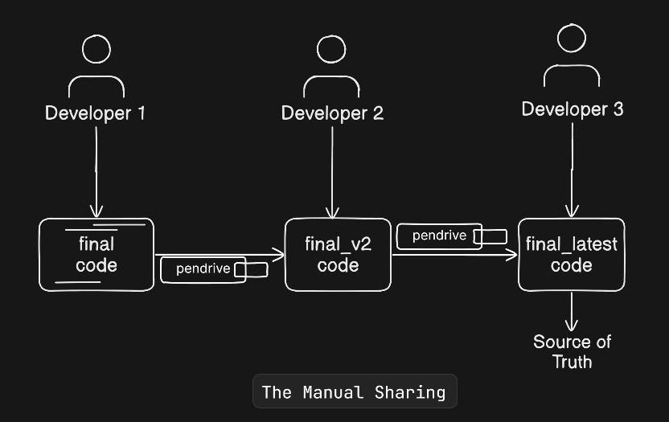
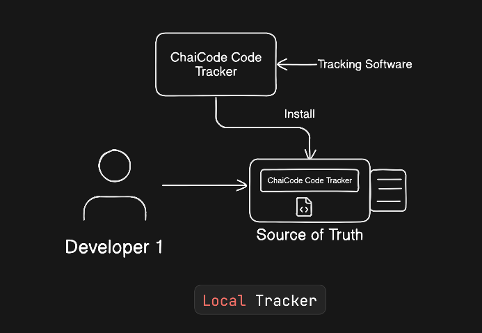
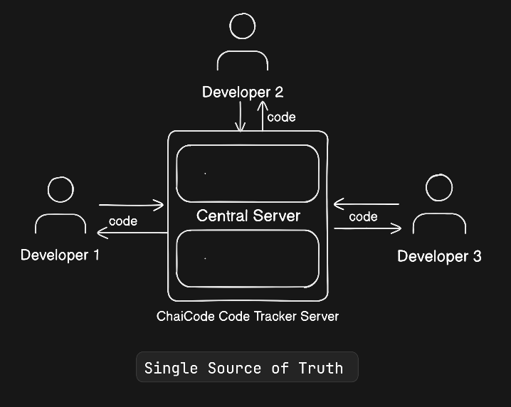

# Why Version Control Exists: The Pendrive Problem


When I first started learning software development, I didn’t want to just memorize Git commands.
I wanted to understand the **why** behind them.

To find that answer, I went back to the basics — and that’s when I realized something important:

> The biggest enemy of a developer isn’t a bug.
> It’s the **pendrive**.

This is the story of how software development moved from manual chaos to a **Single Source of Truth**.

---

## Phase 1: The Manual Sharing Problem

Imagine you are working on a project as **Developer 1**.
You write some code and everything works fine.

As the project grows, you need help with a feature or a bug, so **Developer 2** joins in.
Later, the scope increases even more, and **Developer 3** becomes part of the team.

In the early days, the solution was simple — and dangerous.

You would copy the entire project onto a **pendrive** and hand it over.

Developer 2 would make changes, then pass the same pendrive forward.
That was collaboration.



### The Problems

-   **Loss of Control**
    The moment the pendrive leaves your hand, you lose control over the codebase.

-   **The “What Changed?” Question**
    When the pendrive comes back, you have no idea:

    -   What files were changed
    -   What lines were modified
    -   Why those changes were made

-   **The Overwrite Trap**
    While the pendrive is away, you might continue working locally.
    Now there are two versions of the same file.
    When you try to combine them, one version overwrites the other.

-   **The Folder Mess**
    To stay “safe,” you create folders like:

    ```
    final/
    final_v2/
    final_latest/
    latest_final_fixed/
    ```

    Nobody knows which one is correct.

There is no **source of truth** — only confusion.

---

## Phase 2: Installing a Tracker (A Local Source of Truth)

To escape the pendrive chaos, one thing becomes clear:
I needed a **source of truth**.

So I introduced a **code tracker**.
Let’s call it **CCT — ChaiCode Tracker**.

This wasn’t about collaboration yet.
This was about **clarity**.

CCT watches every change you make and records it permanently.



### What This Solves

With CCT, your local machine finally becomes a **single source of truth** — at least for you.

Now, if you need help from another developer, you can hand over the pendrive **with CCT installed and the code tracked**.
When another developer modifies the code, those changes are also recorded.

Suddenly, you can answer critical questions instantly:

-   **Who** wrote this code?
-   **What** exactly was changed?
-   **When** and **why** did the change happen?

If a bug appears, you don’t guess anymore.
You can trace the exact change that introduced it and fix the problem properly.

This is the moment development shifts from:

> “I think this change broke something.”

To:

> “This commit introduced the issue.”

### The Limitation

There’s still a major limitation.

This source of truth is **local**.
True collaboration still doesn’t exist.

Developers can’t work **in parallel**, because the pendrive is still the bottleneck.
Only one person can have the code at a time.

CCT gives control —
but not a collaboration.

### Why This Forces Phase 3

At this point, one realization becomes unavoidable:

> A source of truth is only useful if everyone agrees on it.

That leads directly to the next step — moving this local source of truth to a **central location** where the entire team can rely on the same history.

---

## Phase 3: The Single Source of Truth

The real breakthrough happens when the tracker is no longer local.

Instead of tracking changes on individual machines, the tracker is moved to a **central server** — the **CCT Server**.



### What Changes Now

This server becomes the **Single Source of Truth** for the entire team.

-   Every developer connects to the same repository
-   Everyone can work in parallel
-   Every change is recorded in one shared history

No more pendrives.
No more emailing ZIP files.

The physical transfer of code disappears — replaced by a digital **remote server**.

This is the moment collaboration truly begins.

---

## Phase 4: The Tools We Use Today

In modern development, this system is clearly split into two parts.

### 1. Version Control System (The Engine)

-   Git
-   Mercurial
-   Subversion (SVN)
-   TFS

These tools handle:

-   Change tracking
-   History
-   Accountability
-   Rollbacks

### 2. VCS Remote (The Server)

-   GitHub
-   GitLab
-   Bitbucket
-   AWS CodeCommit
-   Gitea

These platforms provide:

-   A shared repository
-   Team collaboration
-   Access control
-   A true single source of truth

Even the most popular tools were born from real pain.

**Linus Torvalds** created **Git** to manage the Linux kernel — because massive collaboration simply could not survive with manual file sharing.

---

## Final Thoughts

Version control is not just a technical tool.
It’s a **collaboration contract**.

The shift from pendrives to a **Single Source of Truth** is the moment a developer moves from working alone to working as part of a professional team.

If you’ve ever wondered why Git feels mandatory —
this is why.
