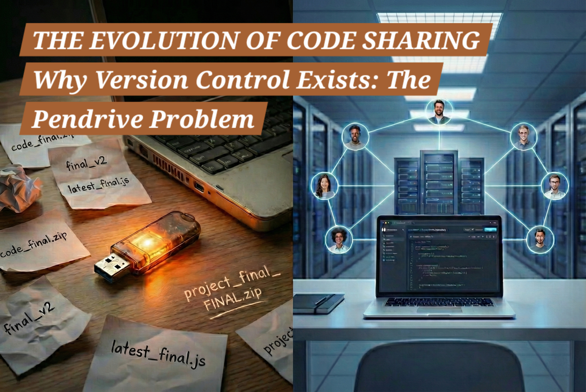

# Why Version Control Exists: The Pendrive Problem



When I first started learning software development, I didn’t want to just memorize Git commands.
I wanted to understand the **_why_** behind them.

To find that answer, I went back to the basics — and that’s when I realized something important:

> The biggest enemy of a developer isn’t a bug.
> It’s the **pendrive**.

This is the story of how software development moved from manual chaos to a **Single Source of Truth**.

---

## Phase 1: The Manual Sharing Problem

Imagine I’m working on a project as **Developer 1**.
I write some code and everything works fine.

As the project grows, I need help with a feature or a bug, so **Developer 2** joins in.
Later, the scope increases even more, and **Developer 3** becomes part of the team.

In the early days, the solution was simple — and dangerous.

I would copy the entire project onto a **pendrive** and hand it over.

Developer 2 would make changes, then pass the same pendrive forward.
That was collaboration.

### The Problems

-   **Loss of Control**
    The moment the pendrive leaves my hand, I lose control over the codebase.

-   **The “What Changed?” Question**
    When the pendrive comes back, I have no idea:

    -   What files were changed
    -   What lines were modified
    -   Why those changes were made

-   **The Overwrite Trap**
    While the pendrive is away, I might continue working locally.
    Now there are two versions of the same file.
    When we try to combine them, one version overwrites the other.

-   **The Folder Mess**
    To stay “safe,” we create folders like:

    ```
    final/
    final_v2/
    final_latest/
    latest_final_fixed/
    ```

    Nobody knows which one is correct.

There is no **source of truth** — only confusion.

---

## Phase 2: Installing a Tracker (A Local Source of Truth)

To escape the pendrive chaos, I realized I needed something fundamental — a **source of truth**.

So I introduced a **code tracker** on my own machine.
Let’s call it **CCT — Chai Code Tracker**.

This wasn’t about collaboration yet.
This was about **clarity**.

CCT watches every change I make and records it permanently.

### What This Solves

With CCT, my local machine finally becomes a **single source of truth** — at least for me.

Now I can answer critical questions instantly:

-   **Who** wrote this code? _(me)_
-   **What** exactly was changed?
-   **When** did the change happen?

If a bug appears, I don’t guess.
I can trace the exact change that introduced it and fix it properly.

This is the moment development shifts from:

> “I think this change broke something”

to:

> “This commit introduced the issue.”

### The Limitation

But there’s an important limitation.

This source of truth is **local**.

-   My CCT knows my changes
-   Another developer’s CCT knows their changes
-   There is **no shared history**

As soon as more developers join, we are forced back to:

-   Pendrives
-   Emails
-   Manual copying

So while **tracking exists**, **collaboration still doesn’t**.

CCT gives me control —
but not a team.

### Why This Forces Phase 3

At this point, one thing becomes obvious:

> A source of truth is only useful if everyone agrees on it.

That realization leads directly to the next step —
moving this local source of truth to a **central server**, where the entire team can rely on the same history.

---

## Phase 3: The Single Source of Truth

The real breakthrough happens when the tracker is no longer local.

Instead of tracking changes on individual machines, I move the tracker to a **central server**.

### What Changes Now

This server becomes the **Single Source of Truth** for the entire team.

-   Every developer connects to the same place
-   Everyone works in parallel
-   Changes are recorded in one shared history

No more pendrives.
No more emailing zip files.

The physical transfer of code dies — replaced by a digital **remote server**.

This is the moment collaboration actually works.

---

## Phase 4: The Tools We Use Today

In modern development, this system is split into two clear parts.

### 1. Version Control System (The Engine)

-   Git
-   Mercurial
-   Subversion (SVN)
-   TFS

These tools handle:

-   Change tracking
-   History
-   Accountability
-   Rollbacks

### 2. VCS Remote (The Server)

-   GitHub
-   GitLab
-   Bitbucket
-   AWS CodeCommit
-   Gitea

These platforms provide:

-   A shared repository
-   Team collaboration
-   Access control
-   A true single source of truth

Even the most popular tools came from real pain.

**Linus Torvalds** created **Git** as a side project to manage the Linux kernel — because massive collaboration simply could not survive with manual file sharing.

---

## Final Thoughts

Version control is not just a technical tool.
It’s a **collaboration contract**.

The shift from pendrives to a **Single Source of Truth** is the moment a developer moves from working alone to working as part of a professional team.

If you’ve ever wondered why Git feels mandatory —
this is why.
