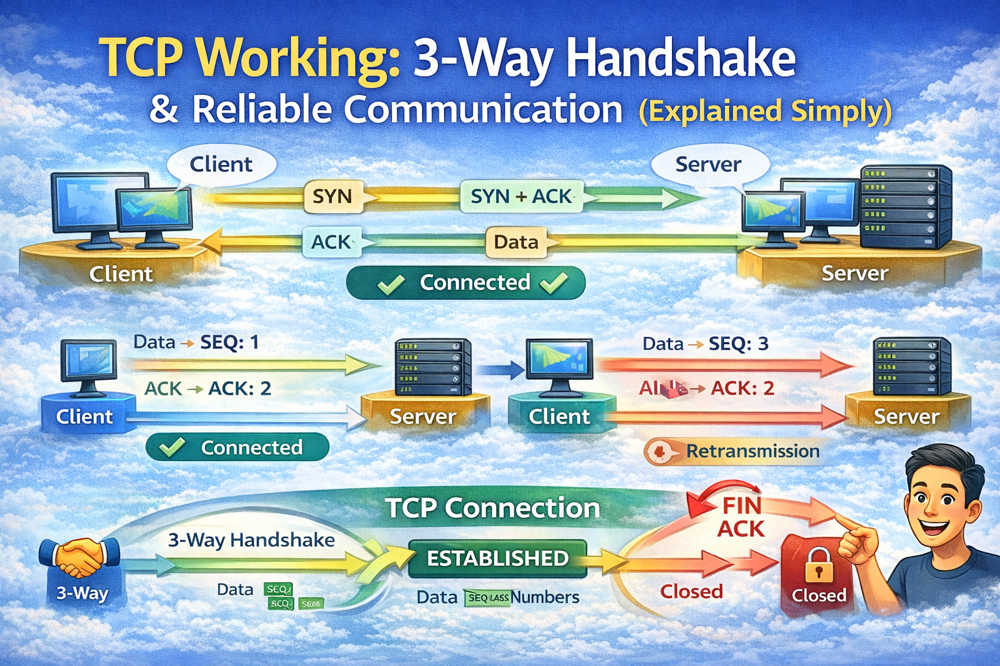

# TCP Working: 3-Way Handshake & Reliable Communication

Imagine you walk into a shop, but before the shopkeeper starts serving you, you first **greet each other and agree you’re ready to talk**. Networking works in a similar way.

When two computers want to talk reliably over a network, they use a protocol called **TCP (Transmission Control Protocol)** to make sure both sides are ready and that messages won’t get lost, arrive out of order, or get corrupted along the way. ([TechTarget][1])

---

## What Is TCP and Why It Is Needed

At a high level, TCP is a protocol that helps two computers communicate **reliably**. It’s used for things like:

- Browsing websites
- Downloading files
- Sending emails
- Communicating between applications

TCP ensures that the data you send:

- **Arrives at the other end**
- **Arrives in the correct order**
- **Is complete**

Without TCP, data might get lost, duplicated, or arrive scrambled — like talking in a noisy room without confirming you were heard. ([TechTarget][1])

---

## Problems TCP Is Designed to Solve

Unreliable networks can cause:

- **Lost packets**
- **Out-of-order packets**
- **Corrupted data**
- **Duplicate packets**

TCP solves these by:

- Using **sequence numbers** so data can be reordered correctly
- Waiting for **ACKs (acknowledgements)** before moving on
- Retransmitting packets if they’re missing
- Using **checksums** to detect corruption ([GeeksforGeeks][2])

This means the application (like your web browser) can ask for data and trust what it gets.

---

## What Is the TCP 3-Way Handshake?

Before two computers transfer data, they must agree to communicate — just like you and a friend confirm you’re both ready before starting a conversation.

This setup is called the **3-way handshake** because three messages are exchanged:

1. **SYN**
2. **SYN-ACK**
3. **ACK** ([MDN Web Docs][3])

---

## Step-by-Step: SYN, SYN-ACK, and ACK

### Step 1 — Client Sends SYN

The **client** (your computer) begins by sending a SYN packet to the server.

- SYN stands for “synchronize”
- It tells the server:

    > “I want to start a connection, and here’s my initial sequence number.” ([Network Walks][4])

Think of this as the client saying “Hello! Are you there?”

---

### Step 2 — Server Replies with SYN-ACK

The **server** receives the SYN and replies with a **SYN-ACK**:

- SYN to synchronize with the client
- ACK to acknowledge the client’s request

This tells the client:

> “Yes, I’m here, and I’m ready. Here’s my sequence number too.” ([System Design Codex][5])

It’s like the server saying “Hi, I heard you. Let’s talk!”

---

### Step 3 — Client Sends ACK

Finally, the client sends an **ACK** back to the server.

This confirms:

- It received the server’s reply
- Both sides are ready to start data transfer ([Network Walks][4])

Once this last ACK is sent, the connection is established and both ends move to the **ESTABLISHED** state.

---

## How Data Transfer Works in TCP

Now that the connection is established, TCP ensures reliable, ordered data transfer using:

### Sequence Numbers

Every byte of data is assigned a number. This helps both sides:

- Reassemble data in order
- Detect missing or duplicate packets ([ScienceDirect][6])

---

### Acknowledgements (ACKs)

After receiving data, the **receiver sends ACKs** to confirm which bytes arrived correctly.
If the sender does not get an expected ACK in time, it **retransmits** the missing data. ([ScienceDirect][6])

This turns an unreliable network into a **reliable stream of bytes**.

---

## How TCP Ensures Reliability, Order, and Correctness

TCP incorporates multiple mechanisms to provide reliable communication:

- **Sequencing:** Keeps packets in order
- **Checksums:** Detects corrupted data
- **Retransmissions:** Resends lost data
- **Flow control:** Prevents overwhelming the receiver ([GeeksforGeeks][2])

This is why TCP is used by systems that cannot tolerate missing or misordered data — like web pages, APIs, databases, and email.

---

## How TCP Connection Is Closed (FIN and ACK Explained)

Ending a TCP connection is just as important as starting it.

TCP uses special control flags:

---

### FIN (Finish)

FIN means:

> “I have finished sending data and want to close my side of the connection.”

It does NOT immediately close everything.

It only signals that one side is done sending.

---

### ACK (Acknowledgment)

ACK means:

> “I received your message.”

It is used throughout TCP communication — including during shutdown.

---

### FIN + ACK Together

Sometimes a device sends **FIN and ACK together**.

This means:

- Acknowledging the last received data
- Simultaneously requesting to close its side

This happens when a device finishes sending data and has nothing more to transmit.

---

## TCP Connection Termination: Four-Way Handshake

Closing a TCP connection happens in **four steps**.

This allows both sides to finish sending remaining data safely.

---

### Step 1 — FIN (Client → Server)

Client sends FIN:

> “I am done sending data.”

---

### Step 2 — ACK (Server → Client)

Server replies with ACK:

> “I received your FIN.”

Now the connection becomes **half-closed**.

The server can still send remaining data.

---

### Step 3 — FIN (Server → Client)

When the server finishes sending its data, it sends its own FIN:

> “Now I am also done.”

---

### Step 4 — ACK (Client → Server)

Client acknowledges the server’s FIN with ACK.

Now both sides agree:

> Communication is finished.

The connection is fully closed.

---

### Important Real-World Behavior

Often:

- One side sends FIN
- The other side ACKs immediately
- But delays sending its own FIN until its data transfer completes

This allows graceful shutdown without cutting off data.

---

## Why TCP Shutdown Is Designed This Way

TCP does not assume both sides finish at the same time.

One side may finish earlier.

The four-step process ensures:

- No data loss
- Clean resource release
- Proper session termination

This design makes TCP stable even in long-running connections.

---

## Final Thoughts

TCP is much more than just “sending data”.

It is a complete communication system that:

- Builds connections
- Guarantees reliability
- Maintains order
- Handles packet loss
- Closes connections safely

Every website you load, every API you call, and every file you download depends on this invisible handshake process working perfectly.

Understanding TCP makes you a stronger backend engineer, system designer, and network-aware developer.

[1]: https://www.techtarget.com/searchnetworking/definition/TCP?utm_source=chatgpt.com "What is TCP (Transmission Control Protocol)?"
[2]: https://www.geeksforgeeks.org/computer-networks/what-is-transmission-control-protocol-tcp/?utm_source=chatgpt.com "Transmission Control Protocol - TCP"
[3]: https://developer.mozilla.org/en-US/docs/Glossary/TCP_handshake?utm_source=chatgpt.com "TCP handshake - Glossary - MDN Web Docs"
[4]: https://networkwalks.com/tcp-3-way-handshake-process/?utm_source=chatgpt.com "TCP 3-way Handshake Process"
[5]: https://newsletter.systemdesigncodex.com/p/tcp-3-way-handshake?utm_source=chatgpt.com "TCP 3-Way Handshake - by Saurabh Dashora"
[6]: https://www.sciencedirect.com/topics/computer-science/transmission-control-protocol?utm_source=chatgpt.com "Transmission Control Protocol - an overview"
