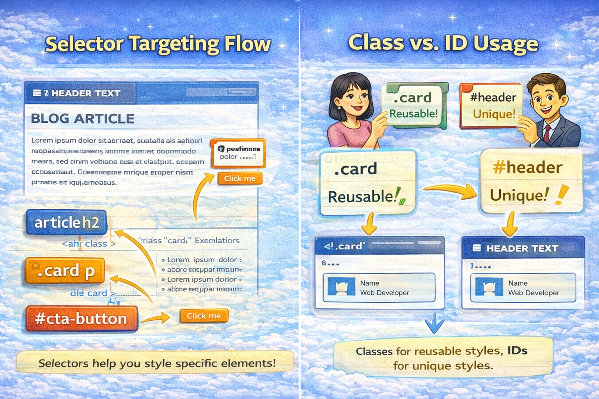

# CSS Selectors 101: Targeting Elements with Precision (Advanced Guide)


CSS is not about colors and fonts.

CSS is about **selecting the right elements** and applying the right rules to them.

If you understand selectors deeply, you gain control over layouts, components, responsiveness, and performance. If you don’t — CSS feels random and frustrating.

Let’s go beyond basics and build a strong mental model.

---

## Why CSS Selectors Exist (The Real Problem They Solve)

HTML creates structure.

CSS styles that structure.

But the browser needs answers to two questions:

1. Which elements should be styled?
2. Which rule wins if multiple rules apply?

Selectors solve the first problem.

Specificity and cascade solve the second.

Without selectors, CSS would be blind.

---

## Think of Selectors as Querying the DOM

When CSS runs, the browser is basically doing this:

> “Find all elements that match this pattern.”

Example:

```css
.card p
```

Means:

- Find all `p` tags
- That are inside elements with class `card`

This is similar to searching inside a tree structure (DOM).

Understanding this mental model makes advanced selectors easier.

---

## Element Selector (Global Styling Tool)

Element selectors apply styles **globally** to all matching tags.

Example:

```css
p {
	line-height: 1.6;
}
```

This affects every paragraph on the page.

### When to Use

- Base typography
- Default spacing
- Consistent layout rules

### When to Avoid

- Component-specific styling
- UI variations

Because element selectors are broad and can cause unwanted side effects.

---

## Class Selector (Component-Level Control)

Classes are the backbone of modern CSS architecture.

Example:

```css
.card {
	padding: 16px;
	border-radius: 8px;
}
```

### Why Classes Are Preferred

Classes:

- Are reusable
- Are predictable
- Scale well in large projects
- Work well with component systems

Frameworks like React, Angular, and Vue rely heavily on class-based styling.

---

## ID Selector (High Specificity Tool)

ID selectors target one unique element.

Example:

```css
#navbar {
	position: fixed;
}
```

### Important Reality

IDs have very high specificity.

This means:

- They override many other rules
- They are hard to override later

### Best Practice

Use IDs:

- For JavaScript targeting
- For anchors
- Rarely for styling

Modern CSS avoids IDs for layout styling because they reduce flexibility.

---

## Group Selectors (Reducing Duplication)

Group selectors help you avoid repeating CSS rules.

Example:

```css
h1,
h2,
h3 {
	font-family: sans-serif;
}
```

### Why This Matters

In production:

- Less CSS duplication
- Smaller bundle size
- Easier maintenance

Grouping is simple but powerful.

---

## Descendant Selectors (Context-Aware Styling)

Descendant selectors allow **context-based styling**.

Example:

```css
.sidebar p {
	color: gray;
}
```

This means:

- Only paragraphs inside `.sidebar` are affected

### This Enables Component Isolation

You can style the same element differently in different areas.

Example:

```css
.card button {
	background: blue;
}

.modal button {
	background: red;
}
```

Same `button` tag — different context.

---

## Direct Child Selector (More Precision)

Descendant selectors match all nested children.

But sometimes you want **only direct children**.

Example:

```css
.container > p {
	color: green;
}
```

This selects:

- Only `p` elements directly inside `.container`
- Not deeply nested ones

This improves predictability and performance.

---

## Attribute Selectors (Targeting by Properties)

You can select elements based on attributes.

Example:

```css
input[type="text"] {
	border: 1px solid black;
}
```

This targets:

- Only text input fields

Useful for:

- Forms
- Buttons
- Validation styling

---

## Understanding Selector Priority (Specificity)

When multiple selectors target the same element, CSS follows priority rules.

### Specificity Order (High → Low)

```
Inline styles
↓
ID selectors
↓
Class / Attribute / Pseudo-class selectors
↓
Element selectors
```

---

### Example

CSS:

```css
p {
	color: blue;
}

.text {
	color: green;
}

#main {
	color: red;
}
```

HTML:

```html
<p
	id="main"
	class="text">
	Hello
</p>
```

### Final Color?

Red.

Because ID selector wins.

---

## Why Over-Specific Selectors Are Dangerous

This is a common beginner mistake:

```css
body .container .card .title span {
	color: red;
}
```

Problems:

- Hard to override
- Hard to maintain
- Breaks component reuse
- Creates “CSS wars”

### Better Approach

Keep selectors:

- Short
- Flat
- Class-based

Example:

```css
.card-title {
	color: red;
}
```

---

## Performance Consideration (Yes, Selectors Matter)

Browsers match selectors from **right to left**.

This means:

```css
.card p span
```

Browser checks:

- span first
- then parent p
- then parent card

Deep selectors increase work.

### Best Practice

Prefer:

- Class selectors
- Short selector chains
- Component-based naming

---

## Before and After (Real Example)

### HTML

```html
<div class="profile">
	<h2>User</h2>
	<p>Developer</p>
</div>
```

---

### Weak CSS

```css
div h2 {
	color: blue;
}
```

Too generic.

---

### Strong CSS

```css
.profile-title {
	color: blue;
}
```

Clear, reusable, predictable.

---

## Why Selectors Are the Foundation of CSS Architecture

Modern CSS systems like:

- BEM
- Utility-first CSS
- Component styling
- Design systems

All depend on good selector strategy.

If your selectors are bad:

- Styling breaks
- Debugging becomes painful
- Scaling becomes impossible

Selectors are not syntax — they are **design decisions**.

---

## Final Thoughts

CSS selectors are not just “ways to choose elements”.

They define:

- Maintainability
- Performance
- Scalability
- Team collaboration

Master these first:

- Element
- Class
- Descendant
- Group
- Attribute
- Specificity basics

Once these are solid, advanced CSS becomes much easier.
