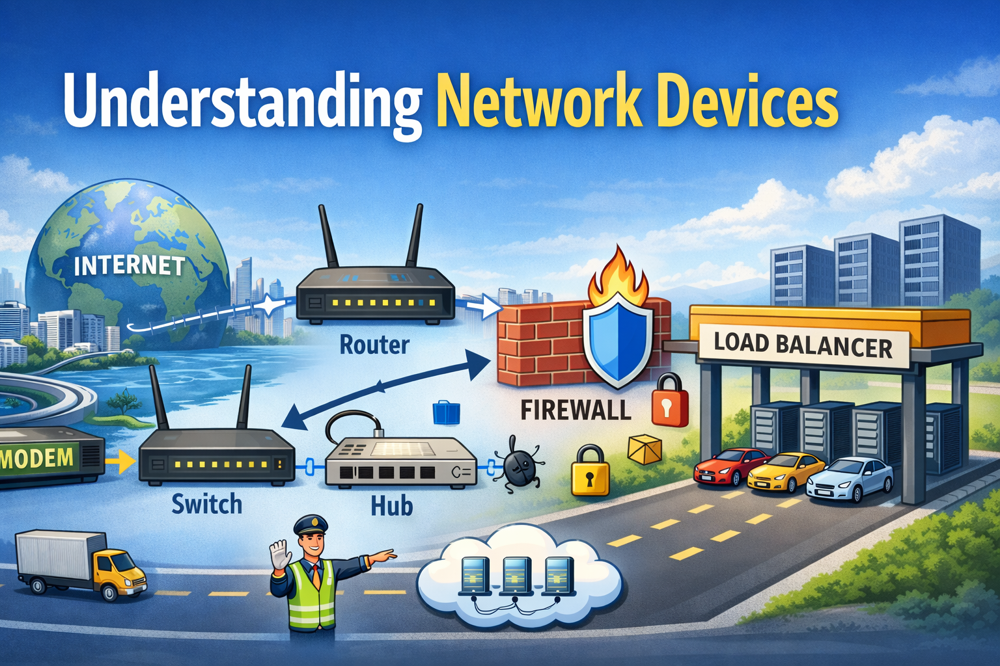

# Understanding Network Devices: How the Internet Actually Reaches Your Application



When you open a website, watch a YouTube video, or call an API, data travels through multiple invisible roads before reaching you.

Behind this “simple click” experience are several **network devices working together** — each with a specific responsibility.

In this blog, we’ll understand how the internet reaches your home or office, what each network device does, and why software engineers should care about them.

Let’s start from the outside world.

---

## High-Level View: How Internet Reaches Your Home or Office

Imagine the internet as a **global highway system**.

Your data starts from a server (maybe in another country), travels through ISP infrastructure, fiber cables, data centers, and finally reaches your building.

Inside your home or office, the data usually flows like this:

```
Internet → Modem → Router → Switch → Your Devices
                          ↓
                      Firewall
                          ↓
                     Load Balancer (in large systems)
```

Each device has a **specific job**, just like workers in a logistics company.

Now let’s understand them one by one.

---

## What Is a Modem and How It Connects You to the Internet?

Think of a **modem as a language translator**.

Your Internet Service Provider (ISP) sends data using signals over fiber, cable, or telephone lines.
Your computer understands digital Ethernet signals.

The modem’s job is simple:

> Convert ISP signals into internet data your local network can use.

### What a Modem Does

- Talks directly to your ISP
- Converts signal formats
- Brings internet into your building

Without a modem, your router would have nothing to connect to.

### Real-World Example

Imagine receiving a package from another country written in a foreign language.
The modem translates it so your local team can read it.

---

## What Is a Router and How It Directs Traffic?

If the modem brings internet inside, the **router decides where the data goes**.

A router is like a **traffic police officer**.

### Router Responsibilities

- Assigns IP addresses to devices
- Sends data packets to the correct device
- Connects local network to the internet
- Handles Wi-Fi connections

When your phone, laptop, and TV all use the internet at the same time, the router ensures everyone gets the right data.

### Simple Example

You request Google.com on your laptop.
Your router says:

> “This request came from Laptop A, so the response should go back to Laptop A.”

That’s routing.

---

## Switch vs Hub: How Local Networks Actually Work

This is where confusion usually happens.

Let’s clear it up simply.

---

### What Is a Hub?

A hub is like a **loudspeaker**.

When one device sends data:

> The hub broadcasts it to ALL connected devices.

### Problems With Hubs

- Wastes bandwidth
- Causes collisions
- No security
- Almost obsolete today

Example:

If PC1 sends data to PC2, every other device also receives it — even if it’s not meant for them.

---

### What Is a Switch?

A switch is smart.

It’s like a **postal delivery system**.

### What a Switch Does

- Sends data only to the intended device
- Uses MAC addresses to identify devices
- Improves network speed
- Reduces traffic congestion

Example:

If PC1 sends data to PC2, only PC2 receives it.

---

### Hub vs Switch Summary

| Feature         | Hub  | Switch   |
| --------------- | ---- | -------- |
| Broadcasts data | Yes  | No       |
| Security        | Low  | High     |
| Speed           | Slow | Fast     |
| Used today      | Rare | Standard |

In modern networks, **switches have replaced hubs**.

---

## What Is a Firewall and Why Security Lives Here?

A firewall is your **network security gate**.

Imagine a security guard checking everyone entering a building.

### Firewall Responsibilities

- Blocks unauthorized traffic
- Allows trusted connections
- Prevents attacks
- Filters ports and protocols

It works using rules like:

- Allow HTTPS (443)
- Block unknown IPs
- Deny suspicious traffic

### Why Firewalls Matter to Developers

If your backend API is deployed on cloud servers:

- Firewall rules protect your database
- Only allowed ports stay open
- Prevent random scanning attacks

This is why DevOps teams always configure firewall rules before deployment.

---

## What Is a Load Balancer and Why Scalable Systems Need It?

Now let’s move to production systems.

When your application grows, **one server is not enough**.

This is where load balancers come in.

Think of a load balancer as a **toll booth manager** on a busy highway.

---

### Load Balancer Responsibilities

- Distributes traffic across multiple servers
- Prevents server overload
- Improves uptime
- Enables horizontal scaling

### Example Scenario

Suppose you have:

- 3 backend servers
- 1 million users

The load balancer decides:

- Request 1 → Server A
- Request 2 → Server B
- Request 3 → Server C

This keeps your app fast and reliable.

---

## How All These Devices Work Together (Real-World Flow)

Let’s see the full journey when a user opens your website.

### Step-by-Step Flow

1. User enters website URL
2. Request reaches ISP
3. Modem converts ISP signal
4. Router routes traffic inside network
5. Firewall checks security rules
6. Load balancer distributes request
7. Backend server responds
8. Response goes back through same path

All of this happens in milliseconds.

Invisible. Automatic. Powerful.

---

## Where These Devices Sit in System Architecture

Here’s a simple architecture view:

```
Internet
   |
 Modem
   |
 Router
   |
 Firewall
   |
 Load Balancer
   |
 Backend Servers
   |
 Database
```

In cloud platforms like AWS, Azure, and GCP:

- Modems and routers are virtual
- Firewalls become security groups
- Load balancers are managed services

But the **core concepts remain the same**.

---

## Why Software Engineers Should Care About Network Devices

You may think:

> “I write code. Why should I learn networking?”

Because real-world production issues are not always code bugs.

Examples:

- API not accessible due to firewall rules
- Server overload without load balancer
- Network latency issues
- Wrong routing configurations

Understanding these basics makes you:

- Better backend developer
- Better DevOps engineer
- More production-ready

---

## Final Thoughts

Network devices are not just hardware boxes sitting in server rooms.

They are the **invisible backbone of every application you build**.

From a simple website to large-scale cloud systems:

- Modems connect you to the world
- Routers guide traffic
- Switches manage local communication
- Firewalls protect your system
- Load balancers enable scale

If you want to become a serious engineer, learning how data moves is just as important as learning how to code.
