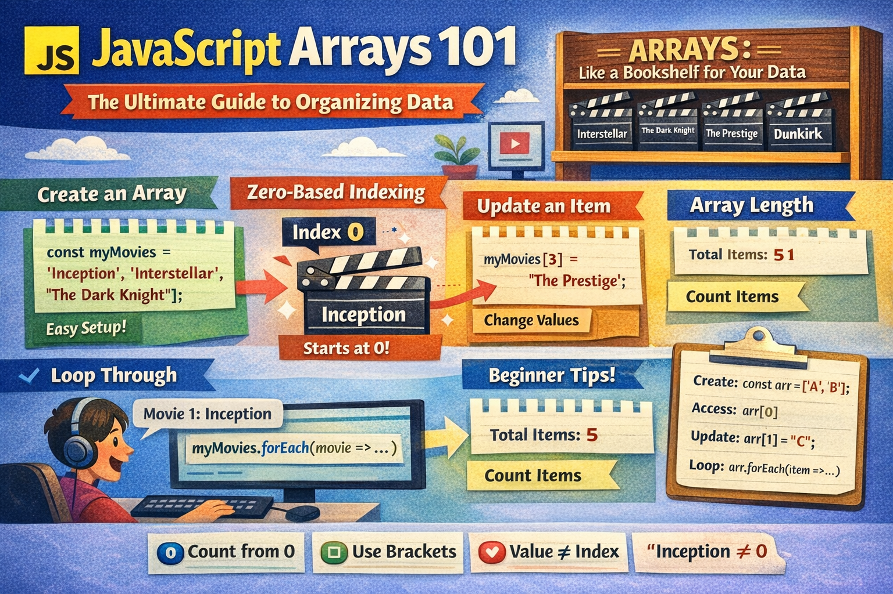
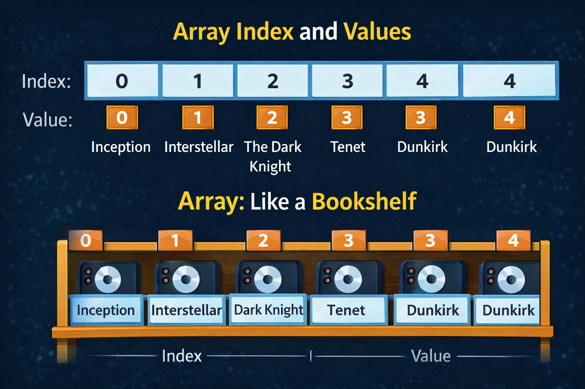
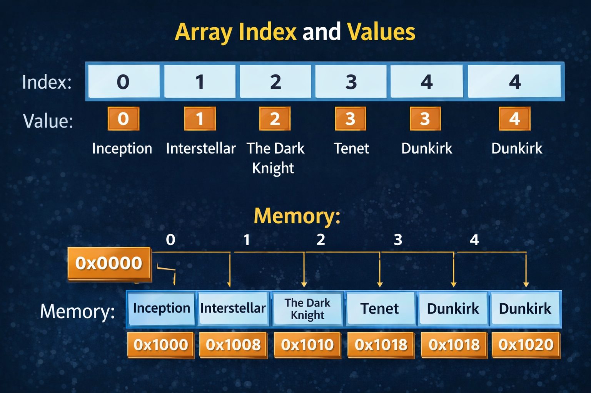

# JavaScript Arrays 101: The Ultimate Guide to Organizing Data



Imagine you’re building a simple app to track a **Movie Marathon**. You have five favorite films you want to watch. Without a smart way to store them, you’d have to create five different variables: `movie1`, `movie2`, `movie3`, and so on.

Now, imagine you have a list of **500** movies. Managing 500 individual variables is not just exhausting—it’s impossible. This is exactly why we use **Arrays**.

## 1. What is an Array? (And Why We Need Them)

In simple terms, an **Array** is a special variable that can hold more than one value at a time.

The diagram below shows how arrays store **values with positions called indexes**.



Each item in an array has two parts:

- **Index** → the position of the item
- **Value** → the data stored in that position

Think of an **array like a bookshelf**.

Each shelf slot represents an **index**, and each book on the shelf represents the **value stored in that position**.

**Why use them?**

- **Grouping:** It keeps related data (like a list of fruits, marks, or tasks) in one container.
- **Order:** It remembers the exact sequence in which you added your items.
- **Scalability:** Whether you have 2 items or 2 million, the way you handle them remains the same.

## 2. How to Create an Array

There are two ways to build your array, but one is much more popular than the other.

### The Array Literal (The Best Way)

This uses square brackets `[]` and is the standard way to write arrays in JavaScript.

```javascript
// Creating a list of 5 favorite movies
const myMovies = [
	"Inception",
	"Interstellar",
	"The Dark Knight",
	"Tenet",
	"Dunkirk",
];
```

### The Array Constructor

You can also use the `new` keyword, though it is less common for simple lists:

```javascript
const passengers = new Array("Alice", "Bob", "Charlie");
```

## 3. The "Zero-Based" Indexing Rule

This is the most important rule in programming: **Computers start counting at 0, not 1.**

Arrays store elements **sequentially in memory**, and each index points to a specific location.



If you have a list of movies, "Inception" is not at position 1. It is at **Index 0**.

### Accessing Elements

To "read" a specific item from your array, you use its index number inside square brackets:

```javascript
console.log(myMovies[0]); // Output: Inception (The first element)
console.log(myMovies[2]); // Output: The Dark Knight (The third element)

// To get the very last element:
console.log(myMovies[myMovies.length - 1]); // Output: Dunkirk
```

## 4. Updating Elements

Arrays in JavaScript are **mutable**, meaning you can change them after they are created. If you decide you'd rather watch "The Prestige" instead of "Tenet," you simply target that index.

```javascript
// Changing the 4th movie (Index 3)
myMovies[3] = "The Prestige";

console.log(myMovies);
// Output: ["Inception", "Interstellar", "The Dark Knight", "The Prestige", "Dunkirk"]
```

## 5. The `.length` Property

The `.length` property is your best friend. It automatically keeps track of how many items are in your array. It’s important to remember that the length is always **one higher** than the highest index.

- **Total Items:** 5
- **Last Index:** 4

```javascript
console.log(myMovies.length); // Output: 5
```

## 6. Looping: The "Tour" of Your Array

What if you want to print every single movie to the screen? You don't want to type `console.log` five times. Instead, you use a **loop**.

### The Classic `for` Loop

This is the "old school" way, giving you total control over where the loop starts and ends.

```javascript
for (let i = 0; i < myMovies.length; i++) {
	console.log(`Movie ${i + 1}: ${myMovies[i]}`);
}
```

### The `forEach` Method

This is the modern, "human-readable" way. It basically says: _"For every item in this array, run this code."_

```javascript
myMovies.forEach((movie, index) => {
	console.log(`Now playing at Screen ${index}: ${movie}`);
});
```

## ⚠️ Common Beginner Mistakes

1. **Off-by-One Error:** Trying to access `myMovies[5]` when there are only 5 items. Remember, the last index is always `length - 1`.
2. **Using Parentheses:** Beginners often try to access items using `myMovies(0)`. In JavaScript, we always use **square brackets** `[]` for arrays.
3. **Confusing Index vs. Value:** The index is the **address** (0, 1, 2), while the value is the **data** ("Inception").

## Summary Cheat Sheet

| Feature      | Code Syntax                | What it does                         |
| ------------ | -------------------------- | ------------------------------------ |
| **Creation** | `const arr = ["A", "B"];`  | Initializes a new array.             |
| **Access**   | `arr[0]`                   | Grabs the first item.                |
| **Update**   | `arr[1] = "C";`            | Changes the second item.             |
| **Count**    | `arr.length`               | Tells you how many items are inside. |
| **Looping**  | `arr.forEach(item => ...)` | Runs a function for every item.      |

Arrays are the foundation of data in JavaScript. Once you master how to store and access values, you're ready to start building real-world features like shopping carts, user lists, or social media feeds.
