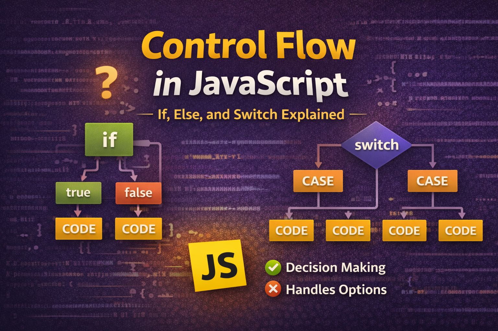

# Control Flow in JavaScript: If, Else, and Switch Explained



In the **previous blog of this JavaScript series**, we explored **[JavaScript Operators: The Basics You Need to Know](https://subhrangsu.hashnode.dev/javascript-operators-the-basics-you-need-to-know)** and learned how operators help us perform calculations, comparisons, and logical checks.

But once we can **compare values**, the next question is:

> How does a program decide **what code should run and what should not?**

This is where **control flow** comes in.

Control flow allows a program to **make decisions and execute different code depending on conditions**.

Just like in real life, we make decisions based on situations.

For example:

- If it rains → take an umbrella
- If you are hungry → eat food
- If you finish work → relax

Programs work in a similar way.

In this article, we will learn how JavaScript handles decisions using:

- `if`
- `if...else`
- `else if`
- `switch`

## What is Control Flow?

**Control flow** refers to the **order in which statements are executed in a program**.

Normally, JavaScript executes code **line by line from top to bottom**.

Example:

```javascript
console.log("Step 1");
console.log("Step 2");
console.log("Step 3");
```

Output

```
Step 1
Step 2
Step 3
```

But sometimes we want code to run **only if a condition is true**.

This is where **conditional statements** help us control the program flow.

## The `if` Statement

The **`if` statement** runs a block of code **only when a condition is true**.

### Syntax

```javascript
if (condition) {
	// code to execute
}
```

### Example

Let's check if someone is eligible to vote.

```javascript
let age = 20;

if (age >= 18) {
	console.log("You are eligible to vote.");
}
```

Output

```
You are eligible to vote.
```

Here:

```
age >= 18
```

If the condition is **true**, the code inside the block runs.

## The `if...else` Statement

Sometimes we want to run **one block of code if the condition is true and another if it is false**.

This is where **`if...else`** is used.

### Syntax

```javascript
if (condition) {
	// runs if condition is true
} else {
	// runs if condition is false
}
```

### Example

```javascript
let age = 16;

if (age >= 18) {
	console.log("You can vote.");
} else {
	console.log("You are too young to vote.");
}
```

Output

```
You are too young to vote.
```

In JavaScript, you don't always need a comparison operator like `age >= 18`. JavaScript can evaluate any variable as a boolean. For example:

```JavaScript
let username = "Alice";

if (username) {
    // This runs because a non-empty string is "truthy"
    console.log("Welcome, " + username);
}
```

## The `else if` Ladder

Sometimes we need to check **multiple conditions**.

For that, we use **`else if`**.

### Example: Checking Marks

```javascript
let marks = 75;

if (marks >= 90) {
	console.log("Grade: A");
} else if (marks >= 70) {
	console.log("Grade: B");
} else if (marks >= 50) {
	console.log("Grade: C");
} else {
	console.log("Fail");
}
```

Output

```
Grade: B
```

The program checks conditions **from top to bottom**.

Once a condition is **true**, the rest are skipped.


## Example Program: Positive, Negative, or Zero

Let’s write a simple program to determine the type of a number.

```javascript
let number = -5;

if (number > 0) {
	console.log("Positive number");
} else if (number < 0) {
	console.log("Negative number");
} else {
	console.log("The number is zero");
}
```

Output

```
Negative number
```

Here we used an **if–else if ladder** because we had **multiple possible conditions**.

## The `switch` Statement

The **`switch` statement** is used when we want to compare **one value against multiple possible cases**.

### Syntax

```javascript
switch (expression) {
	case value1:
		// code
		break;

	case value2:
		// code
		break;

	default:
	// code
}
```

## Example: Day of the Week

```javascript
let day = 3;

switch (day) {
	case 1:
		console.log("Monday");
		break;

	case 2:
		console.log("Tuesday");
		break;

	case 3:
		console.log("Wednesday");
		break;

	case 4:
		console.log("Thursday");
		break;

	case 5:
		console.log("Friday");
		break;

	case 6:
		console.log("Saturday");
		break;

	case 7:
		console.log("Sunday");
		break;

	default:
		console.log("Invalid day");
}
```

Output

```
Wednesday
```


## Why `break` is Important

Inside a `switch`, the **`break` statement stops execution**.

Without `break`, JavaScript will continue running the next cases.

Example without break:

```javascript
let day = 1;

switch (day) {
	case 1:
		console.log("Monday");

	case 2:
		console.log("Tuesday");

	case 3:
		console.log("Wednesday");
}
```

Output

```
Monday
Tuesday
Wednesday
```

This happens because **switch keeps executing cases until it finds a break**.

## When to Use `switch` vs `if...else`

| Situation                                   | Recommended |
| ------------------------------------------- | ----------- |
| Checking ranges (age, marks, numbers)       | `if...else` |
| Comparing one value with many fixed options | `switch`    |

Example:

```
marks > 80 → if-else
day = Monday/Tuesday/Wednesday → switch
```

## Final Thoughts

Control flow is what makes programs **smart and dynamic**.

Using `if`, `else`, `else if`, and `switch`, we can make our programs:

- Take decisions
- Handle multiple conditions
- Execute different logic based on data

These concepts are used **everywhere in real applications**.

In the next article of this JavaScript series, we will explore another important concept that allows programs to **repeat tasks automatically**.
