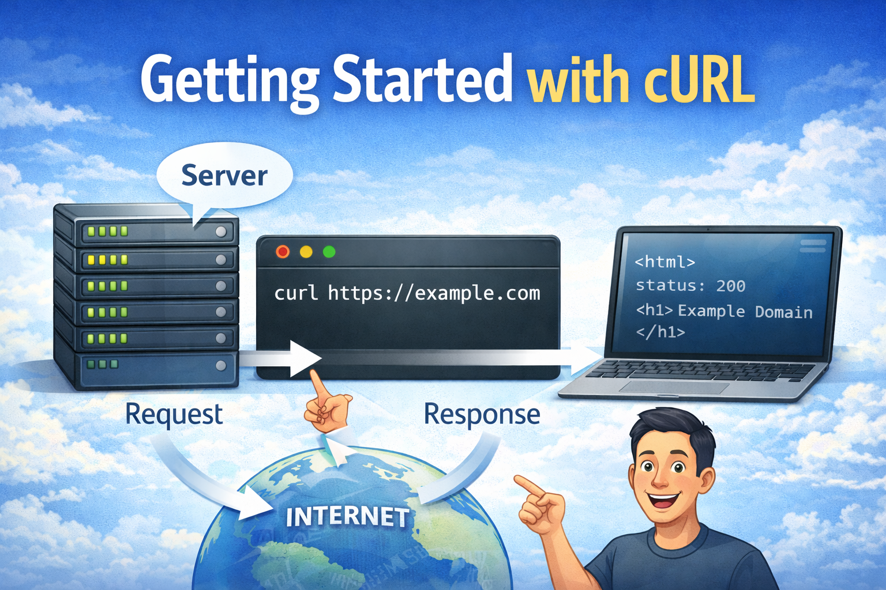

# Getting Started with cURL (For Absolute Beginners)


Before we talk about cURL, let’s understand something simple.

## What Is a Server and Why Do We Need to Talk to It?

A **server** is just a computer that waits for requests.

When you:

- Open a website
- Submit a form
- Call an API
- Log in to an app

Your device is sending a message to a server saying:

> “Hey server, give me this data.”

The server replies with:

> “Here is what you asked for.”

This request–response conversation is the foundation of the web.

Now the question is…

How do we send these messages without a browser?

That’s where **cURL** comes in.

---

## What Is cURL (In Very Simple Terms)?

cURL is a **command-line tool that sends requests to servers**.

Instead of clicking buttons in a browser, you type a command in the terminal and talk directly to a server.

Think of cURL as:

> WhatsApp for servers — but in text commands.

It lets you:

- Fetch web pages
- Call APIs
- Send data
- Test endpoints
- Debug backend services

And the best part?

It works almost everywhere — Linux, Mac, Windows.

---

## Why Programmers Need cURL

If you are learning:

- Backend development
- APIs
- DevOps
- Cloud
- System design

cURL becomes your daily tool.

You use cURL to:

- Test APIs without building UI
- Check if a server is running
- Debug request issues
- Understand HTTP behavior
- Automate network tasks

It gives you **direct control** over network communication.

---

## Making Your First Request Using cURL

Let’s start simple.

Open your terminal and type:

```bash
curl https://example.com
```

Press Enter.

Boom 🎉

You just made your first HTTP request.

---

### What Just Happened?

You told cURL:

> “Go to example.com and get the content.”

The server responded with HTML code.

This is the same thing your browser does — just without showing a webpage UI.

---

## Understanding Request and Response (Simple Version)

Every cURL command follows this pattern:

```
You → Request → Server
Server → Response → You
```

---

### The Request Contains:

- Where to go (URL)
- What to do (GET, POST)
- Optional data

---

### The Response Contains:

- Status code
- Data
- Headers

Let’s understand status first.

---

## Understanding Response Status (Quickly)

Sometimes you may see something like:

```
200 OK
```

That means:

> Everything worked fine.

Common ones you’ll see:

| Code | Meaning      |
| ---- | ------------ |
| 200  | Success      |
| 404  | Not found    |
| 500  | Server error |

You don’t need to memorize everything now — just know:

> Status tells you what happened.

---

## Using cURL to Talk to APIs

Now let’s talk to a real API.

Try this:

```bash
curl https://api.github.com
```

You’ll receive JSON data instead of HTML.

This is how backend developers test APIs.

---

### Why This Is Powerful

Without writing any frontend code:

- You can test endpoints
- Check responses
- See real data
- Debug problems

This saves hours of development time.

---

## Understanding GET and POST (Only the Basics)

Let’s keep it simple.

---

### GET Request (Default)

GET means:

> Give me data.

Example:

```bash
curl https://api.github.com/users/octocat
```

You are asking the server to send information.

---

### POST Request (Sending Data)

POST means:

> Here is some data. Please process it.

Example:

```bash
curl -X POST https://httpbin.org/post
```

This sends a POST request.

For now, just remember:

- GET → Fetch data
- POST → Send data

You’ll learn advanced usage later.

---

## Common Mistakes Beginners Make With cURL

Let’s save you some frustration 😄

---

### Mistake 1: Forgetting https

❌ Wrong:

```bash
curl example.com
```

✅ Correct:

```bash
curl https://example.com
```

Always include protocol.

---

### Mistake 2: Expecting Browser UI

cURL shows **raw server response**, not pretty pages.

That’s normal.

---

### Mistake 3: Copying Complex Commands Too Early

Many tutorials throw 10 flags at beginners.

Avoid that.

Start with:

- Simple GET
- Simple POST
- One option at a time

---

### Mistake 4: Thinking cURL Is Only for APIs

cURL works with:

- Websites
- APIs
- Files
- Authentication
- Uploads
- Downloads

It’s much more than an API tool.

---

## Why Learning cURL Builds Strong Backend Skills

When you use cURL, you start to understand:

- How HTTP really works
- What servers actually return
- How APIs communicate
- How debugging is done in production

This knowledge transfers directly to:

- Postman
- Frontend fetch
- Axios
- Backend frameworks
- DevOps pipelines

---

## Final Thoughts

cURL may look scary at first.

But it’s actually one of the **most empowering tools** for developers.

You don’t need UI.
You don’t need frameworks.
You just talk directly to servers.

If you master the basics of cURL, you’ll never feel blind while working with APIs again.
