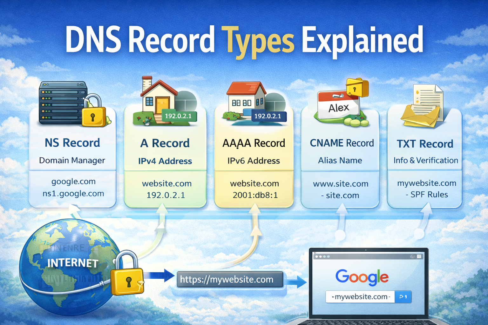

# DNS Record Types Explained



Let’s start with a simple question:

> How does your browser know where a website lives?

When you type `google.com`, your browser doesn’t magically understand where Google’s servers are located.
It asks DNS for help.

And DNS answers using something called **DNS records**.

In this blog, we’ll understand what DNS records are, why they exist, and what each common record type actually does — without scary technical language.

---

## What Is DNS?

DNS is the **phonebook of the internet**.

Humans use names like:

- google.com
- amazon.com
- mywebsite.dev

Computers use numbers like:

- 142.250.183.110
- 54.239.28.85

DNS exists to translate:

> Website name → Server address

Without DNS, you would need to remember IP addresses to open websites. That would be painful.

---

## Why DNS Records Are Needed

DNS itself is just a system.

The **real information lives inside DNS records**.

DNS records tell the internet:

- Where your website server is
- Who manages your domain
- Where emails should be delivered
- How domain ownership is verified
- Which name points to which service

Think of DNS records as **instructions stored for your domain**.

Now let’s understand them one by one.

---

## What Is an NS Record? (Who Is Responsible for This Domain?)

NS means **Name Server**.

NS records answer this question:

> Which server is responsible for managing this domain’s DNS?

### Real-Life Example

Imagine you register a new house.

You must tell the government:

> Which office manages my address record?

NS records do the same thing for domains.

---

### What NS Records Do

- Point to authoritative DNS servers
- Decide who controls the domain’s DNS settings
- Enable delegation

Example:

```
google.com → ns1.google.com
```

It means:

> Google’s DNS servers manage google.com records.

---

## What Is an A Record? (Domain → IPv4 Address)

A record is the **most important DNS record**.

It answers:

> What is the IPv4 address of this domain?

Example:

```
google.com → 142.250.183.110
```

### Real-Life Example

Your house name: “Blue Villa”
Actual address: “Street 10, Building 25”

A record is that **actual address**.

When users open your website, browsers use A records to find your server.

---

## What Is an AAAA Record? (Domain → IPv6 Address)

AAAA record does the same job as A record — but for **IPv6 addresses**.

Why four A’s?

Because IPv6 addresses are much longer.

Example:

```
google.com → 2607:f8b0:4009:80b::200e
```

---

### Why AAAA Records Exist

The internet is running out of IPv4 addresses.

IPv6 was introduced to solve this.

Modern systems often support both:

- A record (IPv4)
- AAAA record (IPv6)

Your browser automatically chooses the best one.

---

## What Is a CNAME Record? (One Name Pointing to Another Name)

CNAME means **Canonical Name**.

It answers:

> This domain is an alias of another domain.

### Example

```
www.mywebsite.com → mywebsite.com
```

Here:

- www is not pointing to an IP
- It points to another domain name

DNS will then resolve the final IP from that target.

---

### Real-Life Example

Your nickname: “Alex”
Official name: “Alexander Smith”

CNAME is like saying:

> Alex is the same person as Alexander.

---

### Common Beginner Confusion: A vs CNAME

- **A Record** → Points to IP address
- **CNAME Record** → Points to another domain name

Simple rule:

> If you already have an IP, use A.
> If you want aliasing, use CNAME.

---

## What Is an MX Record? (How Emails Find Your Mail Server)

MX means **Mail Exchange**.

MX records answer:

> Where should emails for this domain be delivered?

Example:

```
example.com → mail.google.com
```

---

### Why MX Records Are Needed

Your website server and email server are often different.

MX records allow:

- Gmail
- Outlook
- Zoho Mail

to handle emails for your domain.

Without MX records:

> Emails sent to your domain will fail.

---

### Common Beginner Confusion: NS vs MX

- **NS Record** → Who manages DNS
- **MX Record** → Who receives emails

They solve completely different problems.

---

## What Is a TXT Record? (Extra Information & Verification)

TXT records store **text-based data**.

They are commonly used for:

- Domain ownership verification
- Email security (SPF, DKIM, DMARC)
- Third-party service validation

---

### Example Uses

- Google Search Console verification
- Cloudflare verification
- Email spam protection rules

Example:

```
v=spf1 include:_spf.google.com ~all
```

Looks confusing, but it simply tells:

> Which mail servers are allowed to send emails for this domain.

---

## How All DNS Records Work Together (Real Website Example)

Let’s say you own:

```
mywebsite.com
```

Here’s how DNS records work together:

---

### Step 1 — NS Record

Tells the internet:

> Cloudflare manages this domain.

---

### Step 2 — A Record

Maps domain to server:

```
mywebsite.com → 103.21.59.22
```

Your website loads using this.

---

### Step 3 — CNAME Record

Maps subdomain:

```
www.mywebsite.com → mywebsite.com
```

Both URLs work.

---

### Step 4 — MX Record

Handles email:

```
mywebsite.com → Gmail mail servers
```

Your email works.

---

### Step 5 — TXT Record

Adds security and verification:

- Email protection
- Domain ownership
- Platform verification

---

All these records together make your website:

- Accessible
- Secure
- Email enabled
- Globally reachable

---

## Final Thoughts

DNS records may look confusing at first.

But when you see them as **problem solvers**, everything becomes simpler:

- NS → Who manages domain
- A → Where website lives
- AAAA → IPv6 version
- CNAME → Alias mapping
- MX → Email delivery
- TXT → Verification & security

If you are learning backend, DevOps, cloud, or system design — DNS is not optional knowledge.

It is foundational.
