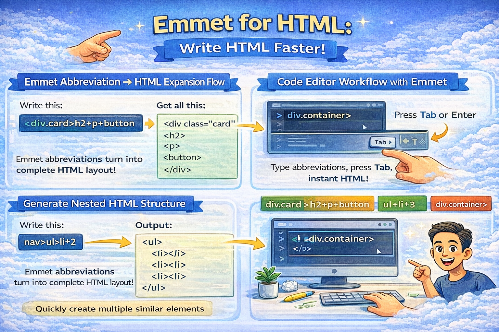

# Emmet for HTML: A Beginner’s Guide to Writing Faster Markup


Let’s be honest.

Writing HTML like this again and again feels slow and repetitive:

```html
<div class="card">
	<h1></h1>
	<p></p>
</div>
```

Now imagine writing **one short line** and getting all of this instantly.

That’s exactly what **Emmet** does.

Emmet is one of the most powerful productivity tools for web developers — especially beginners learning HTML.

Let’s understand it step by step.

---

## What Is Emmet? (In Very Simple Terms)

**Emmet is a shortcut language for writing HTML faster.**

Instead of typing full HTML tags manually, you write short abbreviations and let your code editor expand them into complete markup.

Think of Emmet as:

> Auto-complete on steroids for HTML.

---

## Why Emmet Is Useful for HTML Beginners

When you are learning HTML, you already have many things to remember:

- Tags
- Structure
- Nesting
- Attributes
- Indentation

Emmet helps you:

✅ Write less code
✅ Avoid typing mistakes
✅ Focus on structure
✅ Build layouts faster
✅ Practice HTML patterns

It saves time and keeps you motivated.

---

## How Emmet Works Inside Code Editors

Emmet is built into most modern editors.

It works out of the box in:

- VS Code (recommended)
- Sublime Text
- Atom
- WebStorm

### How It Works

1. You type an abbreviation
2. Press **Tab** or **Enter**
3. Emmet expands it into HTML

That’s it.

No installation needed in VS Code.

---

## Basic Emmet Syntax (The Foundation)

Let’s start small.

---

### Creating an HTML Element

Type this:

```
p
```

Press Tab 👇

**Output:**

```html
<p></p>
```

---

Another example:

```
h1
```

**Output:**

```html
<h1></h1>
```

You just created tags without typing angle brackets.

---

## Adding Classes, IDs, and Attributes

Now let’s make it more useful.

---

### Adding a Class

Use dot `.`

```
div.container
```

**Output:**

```html
<div class="container"></div>
```

---

### Adding an ID

Use hash `#`

```
section#hero
```

**Output:**

```html
<section id="hero"></section>
```

---

### Adding Attributes

Use square brackets `[ ]`

```
img[src="cat.jpg" alt="Cute Cat"]
```

**Output:**

```html

```

Perfect for images and inputs.

---

## Creating Nested Elements

Real HTML is not flat — it’s nested.

Emmet makes nesting very easy using `>`.

---

### Example

```
div>p
```

**Output:**

```html
<div>
	<p></p>
</div>
```

---

### Deeper Nesting

```
div>ul>li
```

**Output:**

```html
<div>
	<ul>
		<li></li>
	</ul>
</div>
```

You just created a structure in one line.

---

## Repeating Elements Using Multiplication

Often we create multiple similar elements.

Emmet uses `*` for repetition.

---

### Example

```
li*3
```

**Output:**

```html
<li></li>
<li></li>
<li></li>
```

---

### Nested Repetition

```
ul>li*4
```

**Output:**

```html
<ul>
	<li></li>
	<li></li>
	<li></li>
	<li></li>
</ul>
```

Great for lists, cards, menus, grids.

---

## Combining Everything (Real Example)

Let’s create a card layout.

### Emmet Input:

```
div.card>h2+p+button
```

### Output:

```html
<div class="card">
	<h2></h2>
	<p></p>
	<button></button>
</div>
```

Readable. Clean. Fast.

---

## Generating Full HTML Boilerplate with Emmet

This is one of the most popular Emmet shortcuts.

Type:

```
!
```

Press Tab.

---

### Output:

```html
<!DOCTYPE html>
<html lang="en">
	<head>
		<meta charset="UTF-8" />
		<title>Document</title>
	</head>
	<body></body>
</html>
```

Your entire HTML page setup is ready in seconds.

This alone saves huge time daily.

---

## Side-by-Side Example (How Emmet Helps)

### Without Emmet 😓

You type:

```html
<div class="box">
	<p></p>
</div>
```

---

### With Emmet 😎

You type:

```
div.box>p
```

Press Tab → Done.

Less typing. Same result.

---

## Common Beginner Mistakes

Let’s avoid frustration early.

---

### Mistake 1: Forgetting to Press Tab

Emmet works only when you press **Tab** or **Enter** after abbreviation.

---

### Mistake 2: Trying Too Much Syntax Early

Don’t jump into advanced Emmet tricks.

Start with:

- Elements
- Classes
- IDs
- Nesting
- Repetition

That’s enough for daily use.

---

### Mistake 3: Thinking Emmet Is Mandatory

Emmet is optional.

HTML still works without it.

But once you use it, you won’t want to go back.

---

## Why Emmet Is a Superpower for Daily Development

Professional developers use Emmet daily for:

- Layout creation
- UI scaffolding
- Rapid prototyping
- Repetitive HTML structures

It keeps you fast and focused on logic instead of typing.

---

## Final Thoughts

Emmet doesn’t replace HTML.

It **accelerates HTML writing**.

If you are learning frontend development, mastering basic Emmet shortcuts will instantly boost your productivity and confidence.

Start small:

- Try `div`, `p`, `!`
- Practice nesting
- Use repetition

Within days, you’ll feel the speed difference.
