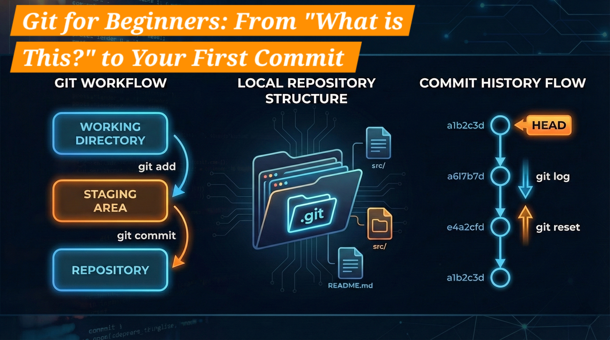

# Git for Beginners: From “What Is This?” to Your First Commit



Have you ever worked on a project, made a mistake, and wished you could just **“Control + Z” your entire life** back to two hours ago?
Or collaborated on a group project where everyone emailed files named:

```
final_v2_REALLY_FINAL.docx
```

That frustration is exactly why **Git** exists.

## What Is Git?

Git is a **Version Control System (VCS)**.

Think of it as a **high-tech “Save Game” system for your code**.
Instead of overwriting files, Git records **snapshots** of your project over time.

This allows you to:

-   Go back in time
-   Experiment safely
-   Work with others without breaking each other’s code

> 📌 Git is the tool.
> GitHub / GitLab are places where Git repositories are stored remotely.

---

## Why Do We Use Git?

Git solves real developer problems:

-   **History** – See what changed, when, and why
-   **Safety** – Broke something? Revert instantly
-   **Collaboration** – Multiple developers, zero chaos

---

## Core Git Terminologies (Very Important)

Before touching commands, you need Git’s mental model.

---

### 1. Repository (Repo)

A **repository** is a project tracked by Git.

-   **Local repository** → on your computer
-   **Remote repository** → on GitHub / GitLab / Bitbucket

When you run:

```bash
git init
```

Git creates a hidden folder:

```
.git/
```

📌 This `.git` folder is the **brain of Git**
Everything lives here: commits, branches, history, and HEAD.

---

### 2. Working Directory

This is where you:

-   Write code
-   Edit files
-   Delete files

Example:

```
index.html
app.js
style.css
```

⚠️ These files are **not tracked automatically**.

---

### 3. Staging Area (The Most Important Concept)

Git does **not** commit directly from your files.

Instead, it uses a middle layer:

```
Working Directory
       ↓ git add
Staging Area
       ↓ git commit
Repository (.git)
```

Why does the staging area exist?

-   Lets you choose **what to save**
-   Prevents accidental commits
-   Gives fine-grained control

---

### 4. Commit

A **commit** is a **snapshot of your project at a moment in time**.

Each commit:

-   Has a **unique hash**
-   Stores file snapshots
-   Points to the previous commit

Think of it as:

> 🎮 “Save checkpoint with a message”

---

### 5. Commit Hash

Example history:

```
commit 1 → hash-01
commit 2 → hash-02
commit 3 → hash-03
```

A **hash** is used to:

-   Compare changes
-   Revert versions
-   Reset history

---

### 6. HEAD (Internal but Critical)

**HEAD points to the current branch, which points to the latest commit.**

```
commit-01 ← commit-02 ← commit-03
                              ↑
                             HEAD
```

-   New commit → HEAD moves forward
-   Reset → HEAD moves backward

---

## The Git Workflow: How It Works Inside

Every Git workflow follows this exact path:

1. Modify files in the **Working Directory**
2. Add selected changes to the **Staging Area**
3. Commit them to the **Repository**

Once this clicks, Git becomes easy.

---

## Essential Git Commands (90% Daily Use)

---

### 1. Start a Project

```bash
git init
```

Initializes a Git repository.

To see the hidden folder:

```bash
ls -a
```

---

### 2. Track Changes

```bash
git status
```

Shows:

-   Untracked files (**U**)
-   Modified files (**M**)
-   Staged files

```bash
git add filename
```

Or add everything:

```bash
git add .
```

Moves files:

```
Working Directory → Staging Area
```

---

### 3. Commit Changes

```bash
git commit -m "Initial commit"
```

This:

-   Saves staged changes
-   Creates a new commit
-   Moves HEAD forward

---

### 4. Inspect History

```bash
git log
```

Short version:

```bash
git log --oneline
```

Example:

```
a1b2c3d Added feature
b2c3d4e Fixed bug
c3d4e5f Initial commit
```

---

### 5. See What Changed

```bash
git diff
```

Compare commits:

```bash
git diff <hash1> <hash2>
```

---

## Understanding Git Internals

### Commit Chain (Linked List)

$$
\boxed{\text{Commit-01}}
\;\xleftarrow{}\;
\boxed{\text{Commit-02}}
\;\xleftarrow{}\;
\boxed{\text{Commit-03}}
\;\xleftarrow{}\;
\boxed{\text{Commit-04}}
\\[6pt]
\hspace{8.5cm}\uparrow
\\
\hspace{8.6cm}\text{HEAD}
$$

Each commit stores:

-   Snapshot of files
-   Reference to the previous commit

This is why Git is **fast and reliable**.

---

## Peeking Inside Git Objects with `git cat-file`

Git stores everything (commits, files, folders) as **objects** inside the `.git` directory.

The command that lets us inspect these objects is:

```bash
git cat-file -p <commit-hash>
```

### Example: Inspect a Commit Object

```bash
git cat-file -p 2b3f9a
```

(Git allows **short hashes** as long as they uniquely identify the object.)

Output looks like:

```
tree a3f5c9...
parent 91ab2d...
author John Doe <john@email.com>
committer John Doe <john@email.com>

Initial project setup
```

### What You’re Seeing

-   **tree** → snapshot of files
-   **parent** → previous commit
-   **author / committer** → who made the change
-   **message** → commit message

📌 Git commits don’t store diffs — they store **snapshots + references**.

---

## Branching (Visualized)

A **branch is just a pointer to a commit**.

```
main:     A → B → C → D
                 \
feature:           E → F
```

HEAD switches between branches.

```bash
git branch
```

Check HEAD directly:

```bash
cat .git/HEAD
```

---

## Undoing Changes

### Safe Undo (Recommended)

```bash
git revert <hash>
```

Creates a **new commit** that undoes a previous one
(best for shared projects).

---

### ⚠️ Dangerous Undo

```bash
git reset --hard <hash>
```

What it does:

-   Moves HEAD backward
-   Deletes commits after it
-   Resets files completely

Use **only when you know what you’re doing**.

---

## A Typical Beginner Workflow

1. Initialize → `git init`
2. Create file → `index.html`
3. Check → `git status`
4. Stage → `git add index.html`
5. Commit → `git commit -m "Initial project setup"`
6. Review → `git log --oneline`

---

## Git Working Areas (Final Summary)

```
[ Working Directory ]
        ↓ git add
[ Staging Area ]
        ↓ git commit
[ Repository (.git) ]
```

This is **the heart of Git**.

---

## Git Cheatsheet (Everything We Learned)

### Repository & Setup

```bash
git init
ls -a
```

### Checking State

```bash
git status
```

### Staging

```bash
git add <file>
git add .
```

### Committing

```bash
git commit -m "message"
```

### History

```bash
git log
git log --oneline
```

### Differences

```bash
git diff
git diff <hash1> <hash2>
```

### Internals

```bash
git cat-file -p <hash>
cat .git/HEAD
```

### Branching

```bash
git branch
```

### Undo

```bash
git revert <hash>
git reset --hard <hash>
```

If this cheatsheet makes sense —
you understand **real Git**, not just commands.

## Conclusion

Git feels intimidating at first because of:

-   Hashes
-   Commands
-   Terminal usage

But once you understand:

> **Working Directory → Staging Area → Repository → HEAD**

Git stops being scary and starts feeling powerful.

You’re no longer afraid of mistakes —
because **Git remembers everything**.
