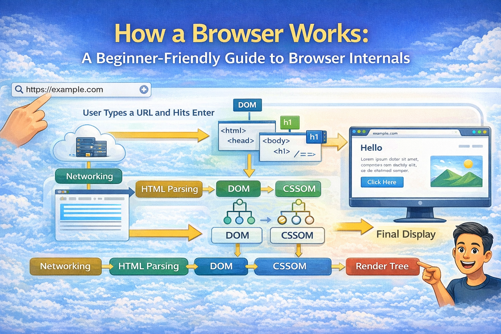

# How a Browser Works: A Beginner-Friendly Guide to Browser Internals


Have you ever wondered what _really_ happens after you type a URL into the address bar and press Enter?

You might think: “The browser just opens a webpage.”
But under the hood, a lot of things happen — and those things are the reason webpages appear fast, correctly styled, and interactive.

In this blog, we’ll break down how a browser works — step by step — using simple explanations and everyday analogies.

---

## What a Browser Actually Is

A **browser** is more than a window that shows websites.

It’s a **software application** that:

- Talks to servers
- Downloads resources
- Parses and interprets code
- Builds structures like the DOM
- Combines styling and layout
- Paints pixels on your screen

It’s like a **mini operating system for web pages** — where each tab is running its own little world.

---

## What Happens After You Press Enter?

Everything begins when you type a URL like:

```
https://example.com
```

That single action triggers a series of carefully coordinated steps.

Let’s follow them in order.

---

## Main Parts of a Browser

To understand the journey, we need to know the main components inside a browser:

1. **User Interface** – address bar, back/forward buttons, tabs, bookmarks
2. **Browser Engine** – manages interactions between UI and core systems
3. **Networking Layer** – fetches data from the internet
4. **Rendering Engine** – parses content and draws it on screen
5. **JavaScript Engine** – executes scripts
6. **Data Storage** – caches, cookies, local storage

Think of the browser like a **theatre production**: the UI is the audience’s window, the engine is the stage manager, the rendering engine is the art department, and the networking layer is the courier bringing in scripts and styles.

---

## User Interface

This is what you see and interact with:

- The **address bar** where you enter the URL
- **Tabs** to open multiple pages
- Navigation buttons
- Loading indicators

This part doesn’t deal with the technical details — it just captures your intent and shows results.

---

## Browser Engine vs Rendering Engine

You don’t need to remember fancy names like **Gecko** or **Blink**, but you should understand the difference:

- **Browser Engine** – orchestrates everything
- **Rendering Engine** – takes code (HTML, CSS) and turns it into pixels

If the browser were a car:

- Browser engine = driver
- Rendering engine = engine and transmission

They work together, but they are not the same.

---

## Networking: Fetching HTML, CSS, and JS

Once the browser knows what URL you want, it uses the networking layer to:

1. Resolve the domain (DNS lookup)
2. Establish a connection (TCP, TLS)
3. Send an HTTP request
4. Receive the server response

The response usually contains:

- **HTML** (structure)
- **CSS** (styles)
- **JavaScript** (behavior)

The browser doesn’t wait for all resources to arrive before it starts working — it begins processing as soon as data arrives.

---

## HTML Parsing and DOM Creation

When HTML starts arriving, the rendering engine begins parsing it.

Think of parsing like **reading a sentence and understanding words**.

HTML is broken down into a **tree structure** called the **DOM (Document Object Model)**.

Example:

```html
<html>
	<body>
		<h1>Hello</h1>
	</body>
</html>
```

Becomes a tree where each tag is a node.

Analogy: DOM is like a **family tree** of all HTML elements.

---

## CSS Parsing and CSSOM Creation

CSS is parsed into another tree called the **CSSOM (CSS Object Model)**.

Where DOM represents structure, CSSOM represents **styling rules** attached to elements.

Example:

```css
h1 {
	color: blue;
}
```

The rendering engine stores this rule so it knows how to style `<h1>` later.

---

## How DOM and CSSOM Come Together

Once both DOM and CSSOM exist, the browser can combine them into a **Render Tree**.

The render tree contains:

- Elements that are visible
- Their computed styles
- Information needed for layout

Hidden elements (like `<script>`, `<meta>`, or `display: none`) do not appear here.

---

## Layout (Reflow), Painting, and Display

Now the browser asks:

> “Where should everything be on the page?”

This step is called **Layout** or **Reflow**.

The render tree nodes are given:

- Coordinates
- Dimensions

Once layout is done, the final step is **Painting** — drawing pixels on the screen.

The result you see is the web page.

---

## A Basic Parsing Analogy

Remember the DOM/CSSOM step? It’s similar to learning a language.

Imagine parsing this sentence:

```
1 + 2 * 3
```

To understand meaning, you need to:

1. Break tokens
2. Identify operations
3. Build a structure representing order of operations.

Just like math parsing, HTML/CSS parsing builds structures the browser can work with later.

---

## Why This Matters

Understanding how a browser works helps you:

- Write better websites
- Debug rendering issues
- Optimize performance
- Know why JavaScript sometimes blocks rendering
- Appreciate what happens between request and display

You don’t need to memorize internal names — but knowing the flow lets you think like a browser.

---

## Final Thoughts

A browser is not magic — it’s a **complex system** with multiple cooperating parts.

From the moment you press Enter:

1. Networking fetches resources
2. HTML and CSS are parsed
3. DOM and CSSOM are created
4. Render tree is built
5. Layout and painting happen
6. Content appears on your screen

You don’t have to understand every detail right away — just the flow.

Once that clicks, you’re already thinking like a web engineer.
