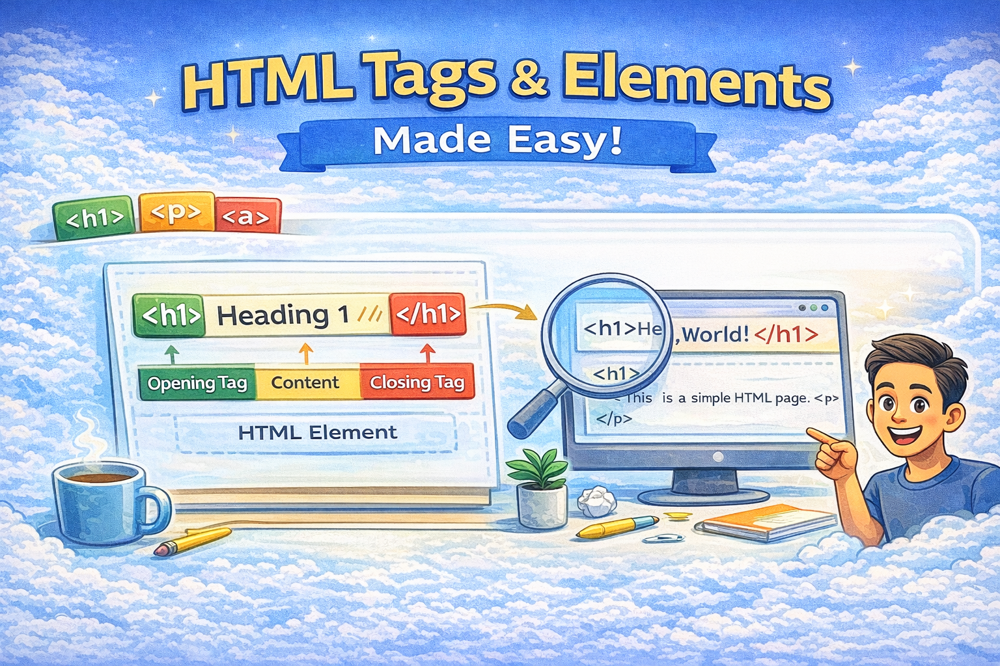

# Understanding HTML Tags and Elements (Beginner-Friendly Guide)



Imagine a webpage like the **framework of a house** — it needs structure before style and behavior are added. That structure comes from **HTML**.

Every webpage you see is built with HTML. But what exactly are HTML tags and elements, and how do they shape what you see on the screen?

Let’s break it down in simple terms.

---

## What HTML Is and Why We Use It

**HTML (HyperText Markup Language)** is the language used to describe the _structure_ of web pages. It tells the browser what parts of the content are headings, paragraphs, images, lists, links, and more. Browsers use this structure to render pages correctly. ([Wikipedia][1])

🧠 Think of HTML like the _skeleton_ of a webpage — everything else (CSS and JavaScript) adds style and behavior.

---

## What an HTML Tag Is

An **HTML tag** is a way of marking content so the browser knows _what it represents_.

Tags are written inside angle brackets:

```html
<p>This is a paragraph</p>
```

Here:

- `<p>` → opening tag
- `</p>` → closing tag
- `This is a paragraph` → content

Tags give meaning to content. Without tags, browsers would just display raw text.

---

## Opening Tag, Closing Tag, and Content

A complete structure in HTML usually has:

1. An **opening tag**
2. Some **content**
3. A **closing tag**

Example:

```html
<h1>Hello World!</h1>
```

But note: some HTML tags don’t need a closing part — more on that next.

---

## What an HTML Element Means

An **HTML element** is the complete unit that consists of:

- The **opening tag**
- The **content** (optional)
- The **closing tag** (if required)

So this whole thing:

```html
<p>Hello</p>
```

counts as _one HTML element_. ([Wikipedia][2])

---

## Self-Closing (Void) Elements

Some elements don’t wrap content — they just represent something by themselves.

These are called **void elements** or **self-closing elements**.

Examples:

```html

<br />
```

They don’t have closing tags because they don’t contain content — they simply act. ([Wikipedia][2])

---

## Block-Level vs Inline Elements

HTML elements also behave differently visually:

### 📏 Block-Level Elements

Block elements take up the _full width_ available and start on a new line.

Examples:

- `<div>`
- `<p>`
- `<h1>` – `<h6>`

Block elements are like paragraphs — clearly separated blocks.

---

### 📄 Inline Elements

Inline elements stay _within the flow_ of text.

Examples:

- `<span>`
- `<a>`
- `<strong>`

Inline elements are like words inside a sentence — they don’t force new lines.

Inline vs block helps you control layout and content flow.

---

## Semantic vs Non-Semantic Elements

Modern HTML emphasizes **meaningful structure**.

### 🔗 Semantic Elements

Semantic elements give both the browser _and developers_ information about content meaning and role. ([w3schools.com][3])

Examples of semantic tags:

- `<header>` – introductory or navigational section
- `<nav>` – navigation links
- `<main>` – primary page content
- `<article>` – standalone content
- `<section>` – thematic grouping
- `<footer>` – footer information
- `<aside>` – related but separate content
- `<figure>` / `<figcaption>` – media with captions

Semantic tags help:

- Improve readability for humans
- Make pages more accessible for screen readers
- Improve SEO since search engines understand meaning better ([w3schools.com][3])

---

### ❓ Non-Semantic Elements

These elements still work — but they don’t tell you _what they mean_. They are general containers used for layout or wrapping content. ([Dremendo][4])

Examples include:

- `<div>` – generic block container
- `<span>` – generic inline container

For example, `<div>` doesn’t tell you what is inside — just that it’s a section. This is useful for styling but doesn’t explain purpose.

---

## Commonly Used HTML Tags

Here are some HTML tags you’ll see often:

| Tag            | Meaning                           |
| -------------- | --------------------------------- |
| `<html>`       | Root of an HTML document          |
| `<head>`       | Meta info (title, CSS, meta tags) |
| `<body>`       | Visible page content              |
| `<h1>`–`<h6>`  | Headings of different levels      |
| `<p>`          | Paragraph                         |
| `<ul>`, `<ol>` | Lists                             |
| `<li>`         | List item                         |
| `<a>`          | Hyperlink                         |
| ``        | Image                             |
| `<div>`        | Non-semantic block container      |
| `<span>`       | Non-semantic inline container     |

Semantic tags like `<header>`, `<nav>`, `<footer>` improve clarity, while non-semantic tags like `<div>` and `<span>` are flexible for layout and styling. ([w3schools.com][3])

---

## A Simple Example

Here’s a tiny HTML page showing different tags:

```html
<!DOCTYPE html>
<html>
	<head>
		<title>My First Page</title>
	</head>
	<body>
		<header>
			<h1>Welcome!</h1>
		</header>
		<main>
			<section>
				<p>This page uses semantic tags.</p>
			</section>
		</main>
		<footer>
			<p>&copy; 2025 My Website</p>
		</footer>
	</body>
</html>
```

---

## Inspecting HTML in the Browser

One of the best ways to learn HTML is to explore real pages:

1. Open any webpage
2. Right-click and choose **Inspect**
3. You’ll see the HTML structure used to build that page

This helps you directly connect what you see with actual HTML code.

---

## Final Thoughts

HTML is the **foundation of web content**. Once you understand:

- What tags are
- What elements are
- The role of semantic vs non-semantic tags

…you’ll read, write, and debug web pages with much more confidence.

Using semantic HTML makes your pages easier to maintain, more accessible, and better understood by search engines and assistive technologies. ([w3schools.com][3])

[1]: https://en.wikipedia.org/wiki/HTML?utm_source=chatgpt.com "HTML"
[2]: https://en.wikipedia.org/wiki/HTML_element?utm_source=chatgpt.com "HTML element"
[3]: https://www.w3schools.com/html/html5_semantic_elements.asp?utm_source=chatgpt.com "HTML Semantic Elements"
[4]: https://www.dremendo.com/html-tutorial/html-non-semantic-elements?utm_source=chatgpt.com "Non-Semantic Elements in HTML"
