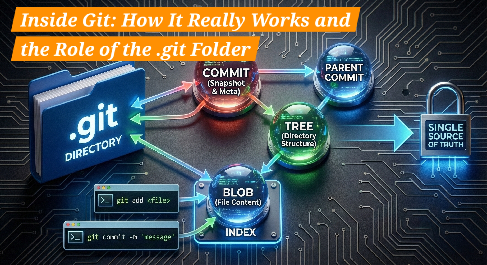

# Inside Git: How It Really Works (With the `.git` Folder Explained)



> Git is not magic.
> Git is just a **very smart storage system**.

Most beginners learn Git by memorizing commands.
But the moment you **visualize what Git is storing and where**, everything starts to click.

In this article, we’ll understand Git using **real code changes**, **human instincts**, **staging**, and **internal storage** — the same way Git actually thinks.

---

## The Core Problem: Code Keeps Changing

Look at a simple change like this:

```diff
+ const fname = 'Subhrangsu';
+ const lname = 'Bera';
- const lname = 'Bera';
const lname = '';
+ // Kuch bi karoge
```

In real life, code changes constantly:

-   lines are added
-   values are removed
-   comments appear
-   logic evolves

### And then a very natural question comes up:

👉 **Where should these changes be stored safely?**

-   MongoDB?
-   MySQL?
-   Postgres?
-   Text file?

Before Git existed, developers genuinely struggled with this question.

---

## A Very Human Idea: `changes.txt`

Let’s imagine Git does **not** exist.

You decide to do something simple and logical.

Inside your project:

```
project/
├── hello.js
└── changes.txt
```

Every time you change code, you **imagine** that this file records what changed.

### Example

`hello.js`

```js
const fname = "Subhrangsu";
const lname = "";
```

You _imagine_ `changes.txt` contains:

```diff
+ const fname = 'Subhrangsu';
+ const lname = 'Bera';
- const lname = 'Bera';
const lname = '';
+ // Kuch bi karoge
```

Honestly?
This idea is **very interesting** — and very human.

Now that we have a human-style solution, let’s test it against real-world development needs.

---

## But Does `changes.txt` Work in Real Projects?

### ❌ Problem 1: Only Diffs, Not a Complete Snapshot

`changes.txt` may contain **some code**, but it only records **differences**.

It never stores the **entire project state** at a specific moment in time.

Tomorrow, if someone asks:

> “What did `hello.js` look like yesterday — exactly?”

You don’t really know.

You would need to:

-   find a correct base version
-   apply diffs in the right order
-   hope nothing is missing

There is:

-   no guaranteed restore
-   no reliable rollback
-   no safe comparison

---

### ❌ Problem 2: History Becomes Unreliable

After a few days, entries become vague:

```txt
Fixed bug
Updated logic
Minor changes
```

Now the history exists…
but it no longer has **clear meaning**.

---

### ❌ Problem 3: Multiple Files = Chaos

Now imagine this:

```
hello.js
feature.js
config.json
```

All files change together.

How do you describe **relationships between changes** using one text file?

You can’t.

---

### ❌ Problem 4: Team Work Is Impossible

Two developers editing:

```
changes.txt
```

at the same time?

💥 conflicts
💥 confusion
💥 broken trust

---

## This Is Exactly Why Git Exists

Git is essentially:

> **An automated, perfect, unbreakable version of `changes.txt`**

But instead of storing **descriptions or diffs**, Git stores **exact snapshots of your project**.

And it stores everything inside one place 👇

```
.git/
```

---

## What Is the `.git` Folder?

When you run:

```bash
git init
```

Git creates a hidden, **database-like folder** called `.git`.

📌 Important truth:

> **`.git` is the repository.**
> Your project folder is just the working area.

Delete `.git` → Git history is gone.

---

## Git Is a Version Control System (VCS)

Conceptually:

```
VCS (Version Control System) → Git
Git → Server Host (GitHub)
```

### Git works in two layers:

#### 1. Local Git

-   Runs on your system
-   Stores everything in `.git`
-   Works offline

#### 2. Remote Git (GitHub)

-   Just a server
-   Stores a copy of your Git data

👉 **GitHub is not Git**
GitHub is only a **host**

---

## Git Tracks Content, Not Files

This is the biggest mindset shift.

Git does **NOT** think:

> “hello.js changed”

Git thinks:

> **“The content inside this file changed”**

That’s why Git can:

-   show `+` and `-`
-   reuse unchanged content
-   track exact history

---

## The Staging Area (Git’s Smart Filter)

This is where Git becomes smarter than `changes.txt`.

### Files in your project:

```
hello.txt
feature.txt
```

You run:

```bash
git add hello.txt
```

### What happens internally?

1. Git reads file content
2. Converts it into a Git object
3. Stores it inside `.git`
4. Marks it in the **staging area (index)**

📌 Result:

-   ✔️ tracked
-   ✔️ ready for commit
-   ❌ not yet in history

---

## Why Staging Exists

Staging allows **selective snapshots**.

```bash
git add hello.txt
git add feature.txt
```

You decide:

-   what goes into the next snapshot
-   what stays unfinished

👉 Dropbox / Google Drive **cannot do this**

---

## What Happens During `git commit`

```bash
git commit -m "updated name variables"
```

Git does **not** store differences.

Git stores a **snapshot**.

Internally Git:

1. Takes staged content
2. Creates **Blob objects** (file content)
3. Groups them into **Tree objects** (folders)
4. Creates a **Commit object**
5. Stores everything in `.git/objects`

📌 A commit is a **snapshot**, not a patch.

---

## Git Objects: The Hidden Heroes

Git internally stores only **three core object types**.

### 1️⃣ Blob → File Content

```
console.log("Hello");
```

No filename. Only content.

---

### 2️⃣ Tree → Folder Structure

```
hello.js → blob
src/ → tree
```

---

### 3️⃣ Commit → Snapshot

Stores:

-   tree reference
-   parent commit
-   author
-   message

Relationship:

```
Commit → Tree → Blob
```

---

## Why Git Is So Reliable (Hashes)

Every Git object is stored using a **hash**:

```
e83c5163316f89bfbde7d9ab23ca2e25604af290
```

Hashes guarantee:

-   data integrity
-   no silent corruption
-   perfect history chain

Change content → hash changes → Git immediately knows.

---

## Visualizing Git as a System

```
Working Directory
   ↓ git add
Staging Area
   ↓ git commit
.git (Object Store)
   ↓ git push
GitHub Server
```

This is **Git in one picture**.

---

## The Mental Model You Should Remember

> Git is a **content-addressed database with a time machine UI**

-   `.git` → database
-   `git add` → prepare snapshot
-   `git commit` → save snapshot
-   `git push` → share snapshot

Once this clicks:
❌ no command fear
❌ no confusion
✅ full confidence

---

## Final Thoughts

You don’t need to memorize Git commands.

You need to understand:

-   **what Git stores**
-   **where it stores**
-   **why it stores snapshots**

The idea of `changes.txt` was never wrong.
It just needed a machine to do it **perfectly**.

And that machine is **Git**.
