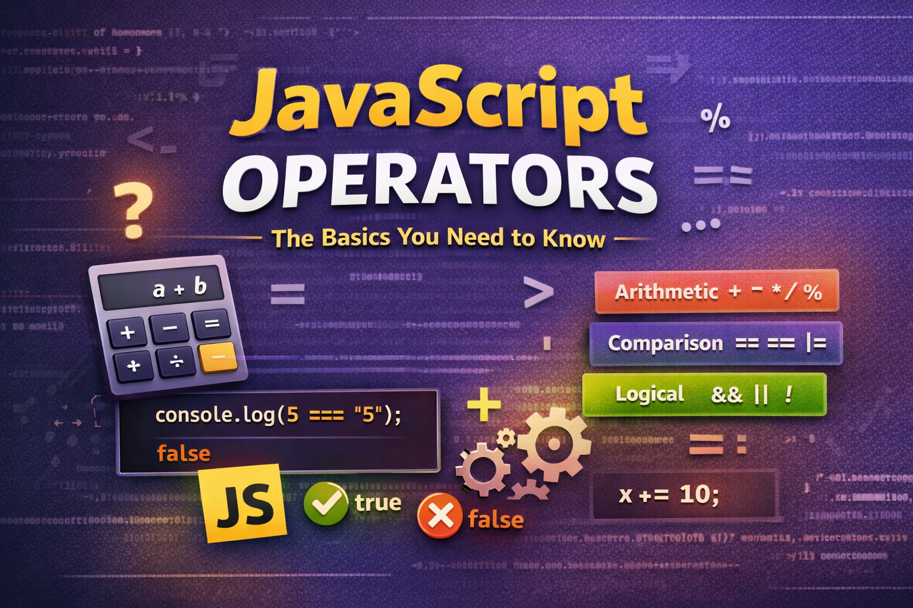

# JavaScript Operators: The Basics You Need to Know



In the **previous blog of this JavaScript series**, we learned about **[Variables and Data Types](https://subhrangsu.hashnode.dev/understanding-variables-and-data-types)** — how JavaScript stores information.

Now the next question is:

> How do we actually **work with those values?**

That’s where **operators** come in.

Operators allow us to **perform calculations, compare values, and create logic in our programs**. They are a fundamental part of writing any JavaScript code.

In this article, we'll explore the most common operators you will use every day.


JavaScript operators can be grouped into several categories such as arithmetic, comparison, logical, and assignment operators.

## What Are Operators?

An **operator** is a symbol that performs an operation on values or variables.

For example:

```javascript
let a = 10;
let b = 5;

let result = a + b;

console.log(result);
```

Here:

```
+  → is an operator
a and b → are operands
```

The operator **combines values to produce a result**.

## Arithmetic Operators

Arithmetic operators are used to perform **basic mathematical calculations**.

| Operator | Description         |
| -------- | ------------------- |
| `+`      | Addition            |
| `-`      | Subtraction         |
| `*`      | Multiplication      |
| `/`      | Division            |
| `%`      | Modulus (remainder) |

### Example

```javascript
let a = 10;
let b = 3;

console.log("Addition:", a + b);
console.log("Subtraction:", a - b);
console.log("Multiplication:", a * b);
console.log("Division:", a / b);
console.log("Remainder:", a % b);
```

Output

```
Addition: 13
Subtraction: 7
Multiplication: 30
Division: 3.3333
Remainder: 1
```

The **modulus operator `%`** is commonly used when checking **even or odd numbers**.

Example:

```javascript
let number = 10;

console.log(number % 2);
```

If the result is `0`, the number is **even**.

## Comparison Operators

Comparison operators allow us to **compare two values**.

They always return **true or false**.

| Operator | Meaning      |
| -------- | ------------ |
| `==`     | Equal        |
| `===`    | Strict equal |
| `!=`     | Not equal    |
| `>`      | Greater than |
| `<`      | Less than    |

### Example

```javascript
let a = 10;
let b = 5;

console.log(a > b);
console.log(a < b);
console.log(a == b);
console.log(a != b);
```

Output

```
true
false
false
true
```

## Difference Between `==` and `===`

This is one of the **most important things to understand in JavaScript**.

### `==` (Loose Equality)

`==` compares values **after converting the type if necessary**.

```javascript
console.log(5 == "5");
```

Output

```
true
```

Because JavaScript converts `"5"` to a number.

### `===` (Strict Equality)

`===` compares **both value and type**.

```javascript
console.log(5 === "5");
```

Output

```
false
```

Because:

```
5 → number
"5" → string
```

Different types → result is `false`.

**Best Practice**

Most developers prefer using **`===`** because it avoids unexpected type conversions.

## Logical Operators

Logical operators help us **combine multiple conditions**.


| Operator | Meaning |     |     |
| -------- | ------- | --- | --- |
| `&&`     | AND     |     |     |
| `\|\|`   | OR      |     |     |
| `!`      | NOT     |     |     |

### AND Operator `&&`

Both conditions must be **true**.

```javascript
let age = 20;

console.log(age > 18 && age < 30);
```

Output

```
true
```

### OR Operator `||`

At least **one condition must be true**.

```javascript
let age = 16;

console.log(age < 18 || age > 60);
```

Output

```
true
```

### NOT Operator `!`

Reverses the result.

```javascript
let isLoggedIn = false;

console.log(!isLoggedIn);
```

Output

```
true
```

## Final Thoughts

Operators are one of the **most fundamental parts of JavaScript**.

They allow us to:

- Perform calculations
- Compare values
- Build logical conditions
- Update variable values

Once you become comfortable with operators, writing real programs becomes much easier.

In the **next article of this JavaScript series**, we’ll explore another core concept that helps control how our programs run.

If you're learning JavaScript, keep practicing small examples in the console.
That’s the fastest way to build confidence.
