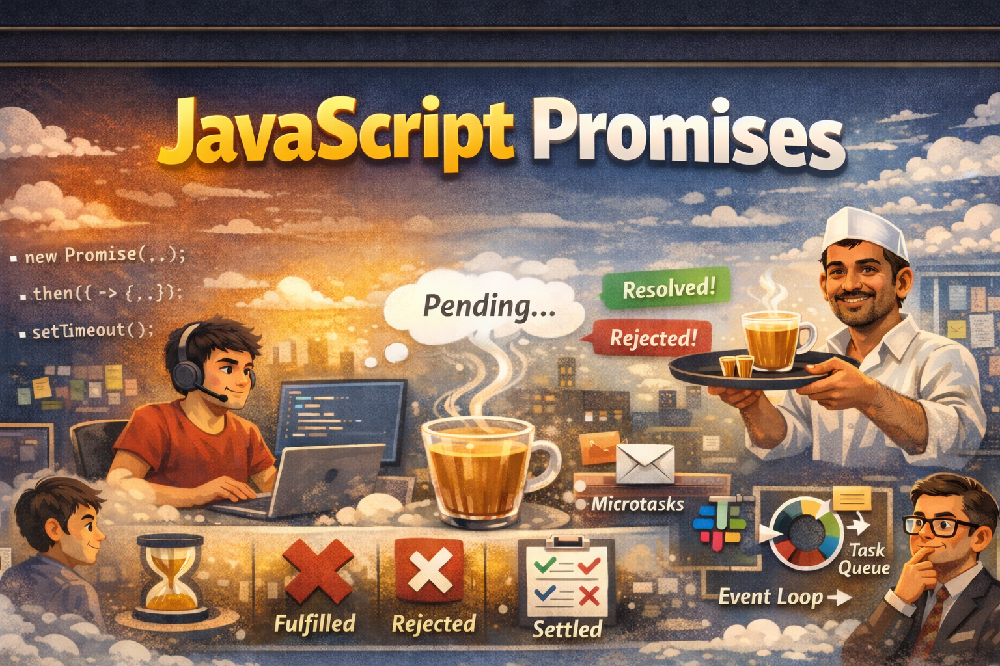

# JavaScript Promises — Office Chai Edition (States, Methods & Event Loop)


_A visual overview of Promise states, chaining, and asynchronous execution flow._

JavaScript Promises are one of the most misunderstood yet essential features in modern JavaScript development.

Most articles explain the syntax.

Very few explain:

- Why Promises exist
- How they actually behave internally
- Why `.then()` doesn’t run immediately
- How microtasks change execution order

So let’s break it down properly.

And to make it memorable, we’ll use something every startup developer understands:

☕ **The 4:30 PM Office Chai Break**

## What Is a Promise — Really?

A **Promise** represents the eventual result of an asynchronous operation. It’s a placeholder for a value that will exist in the future.

That means:

- A Promise starts in **pending**
- It becomes **fulfilled** (success) or **rejected** (failure)
- Once settled, it never changes again

Think of it like ordering chai at work.

You don’t get tea immediately.
You get a commitment that tea will arrive later.

Or maybe it won’t.

That’s a Promise.

## ☕ The Startup Office Chai Scenario

It’s 4:30 PM.

Sprint is heavy.
Production bug open.
Everyone tired.

Someone says:

> “Bhai, chai order karo.”

You place the order.

```js
const chaiOrder = new Promise((resolve, reject) => {
	setTimeout(() => resolve("☕ Chai Arrived!"), 3000);
});

console.log(chaiOrder);
```

At this moment:

```shell
Promise { <pending> }
```

The chai is **pending**.

Not here yet.
But expected.

## Promise States — Office Meaning

| Promise State | Office Reality        |
| ------------- | --------------------- |
| `pending`     | Chai being prepared   |
| `fulfilled`   | Chai delivered        |
| `rejected`    | Chai wala cancelled   |
| `settled`     | Final outcome decided |

Important insight:

Even if the Promise resolves immediately,
`.then()` still won’t execute instantly.

It gets queued.

That’s where microtasks enter the story.

### `.then()` — When Chai Finally Arrives

```js
chaiOrder.then((message) => {
	console.log(message);
});
```

Meaning:

> “Notify me when chai arrives.”

But here’s the deeper truth:

Even if the Promise resolves instantly,
`.then()` runs **after the current call stack clears**.

This is because Promise callbacks are queued as **microtasks**.

They don’t interrupt running code.

They wait politely.

### `.catch()` — Handling Rejection

```js
chaiOrder.catch(() => {
	console.log("No chai today 😭");
});
```

If chai doesn’t arrive,
you handle the failure gracefully.

Without `.catch()`, rejected Promises can cause unhandled errors.

In production systems, that’s dangerous.

### `.finally()` — Break Over Either Way

```js
chaiOrder.finally(() => {
	console.log("Back to debugging 🧑‍💻");
});
```

Whether chai arrived or not,
break time ends.

`.finally()` always runs after settlement.

## Now Let’s Order Multiple Things (Static Methods)

Because one chai is never enough.

### `Promise.all()` — Full Snacks or Nothing

```js
function orderChai() {
	return new Promise((resolve) =>
		setTimeout(() => resolve("☕ Chai ready"), 2000);
	);
}

function orderSamosa() {
	return new Promise((resolve) =>
		setTimeout(() => resolve("🥟 Samosa ready"), 1500),
	);
}

function orderBiscuit() {
	return new Promise((resolve) =>
		setTimeout(() => resolve("🍪 Biscuit ready"), 1000),
	);
}

Promise.all([orderChai(), orderSamosa(), orderBiscuit()])
	.then((items) => {
		console.log("Break Started:", items);
	})
	.catch((error) => {
		console.log("Break Failed:", error);
	});
```

Output:

```code
Break Started: [
  '☕ Chai ready',
  '🥟 Samosa ready',
  '🍪 Biscuit ready'
]
```

This returns a single Promise that:

- Fulfills when **all input promises fulfill** with array of the fulfillment values
- Rejects immediately when **any one rejects**

Office logic:

> “Break tabhi jab chai + samosa + biscuit sab aaye.”

If even one fails, the whole break fails.

Use when:

- All API calls are required
- All resources must load
- Deployment depends on everything

### `Promise.race()` — Fastest Wins

```js
function chai() {
	return new Promise((resolve) =>
		setTimeout(() => resolve("☕ Chai arrived"), 2000),
	);
}

function coffee() {
	return new Promise((resolve) =>
		setTimeout(() => resolve("☕ Coffee arrived"), 1000),
	);
}

Promise.race([chai(), coffee()]).then((result) =>
	console.log("First Item:", result),
);
```

Output:

```code
First Item: ☕ Coffee arrived
```

Returns a Promise that settles with the first settled input Promise.

It does not care whether that result is success or failure.

Office logic:

> Whoever arrives first decides mood.

Used for:

- Timeout patterns
- Competing APIs
- Fastest response logic

### `Promise.any()` — First Success Wins

```js
function failedOrder() {
	return new Promise((_, reject) =>
		setTimeout(() => reject("Out of stock"), 1000),
	);
}

function successfulOrder() {
	return new Promise((resolve) =>
		setTimeout(() => resolve("☕ Chai delivered"), 2000),
	);
}

Promise.any([failedOrder(), successfulOrder()])
	.then((result) => console.log("Success:", result))
	.catch((err) => console.log(err));
```

Output:

```code
Success: ☕ Chai delivered
```

- Fulfills when **any promise fulfills**
- Rejects only if **all promises reject**
- Returns `AggregateError` if all fail

Office logic:

> “Kuch bhi caffeine mil jaaye.”

Failures ignored unless everyone fails.

Perfect for fallback strategies where at least one success is enough.

### `Promise.allSettled()` — Manager Wants Full Report

```js
const orders = [
	Promise.resolve("☕ Chai ready"),
	Promise.reject("❌ Biscuit unavailable"),
	Promise.resolve("🥟 Samosa ready"),
];

Promise.allSettled(orders).then((results) => {
	console.log(results);
});
```

Always fulfills with an array of result objects:

```js
[
	{ status: "fulfilled", value: "☕ Chai ready" },
	{ status: "rejected", reason: "❌ Biscuit unavailable" },
	{ status: "fulfilled", value: "🥟 Samosa ready" },
];
```

Office logic:

The manager wants a full sprint report.

Never rejects.
Always returns structured results.

Ideal for dashboards and logging.

## Advanced Promise Utilities — Hidden Power Tools

Now let’s explore less commonly used but powerful Promise utilities.

### `Promise.resolve()` — Instant Chai

```js
const readyChai = Promise.resolve("☕ Instant chai");

readyChai.then(console.log);
```

Output:

```code
☕ Instant chai
```

Creates an already fulfilled Promise.

Office analogy:

> Chai already on your desk.

But if you pass a thenable:

```js
const thenable = {
	then(resolve) {
		resolve("Followed thenable result");
	},
};

Promise.resolve(thenable).then(console.log);
```

It will _follow_ that Promise’s state.

Meaning:

- If it resolves → it resolves
- If it rejects → it rejects

This is called **Promise assimilation**.

### `Promise.reject()` — Instant Cancellation

```js
Promise.reject("❌ Order cancelled").catch((error) => console.log(error));
```

Creates an already rejected Promise.

Useful for:

- Failing fast
- Input validation
- Early exit in async logic

Office analogy:

> Chai wala immediately says no.

### `Promise.try()` (Non-standard Utility) — Normalize Sync and Async

```js
Promise.try(() => {
	throw new Error("Something went wrong");
}).catch((err) => console.log(err.message));
```

Wraps any function:

- If it returns value → resolved
- If it throws → rejected
- If it returns Promise → followed

Office analogy:

> You safely handle unpredictable chaiwala behavior.

It unifies sync and async error handling.

### `Promise.withResolvers()` — Manual Control Room

```js
const { promise, resolve, reject } = Promise.withResolvers();

promise.then(console.log).catch(console.error);

setTimeout(() => {
	resolve("☕ Chai approved!");
}, 2000);
```

Returns:

- A new Promise
- Its resolve function
- Its reject function

Separately.

Example:

```js
const { promise, resolve } = Promise.withResolvers();

setTimeout(() => resolve("☕ Delivered"), 2000);

promise.then(console.log);
```

Office analogy:

> You hold the “Approve” and “Cancel” buttons yourself.

Useful for:

- Event systems
- Deferred patterns
- Framework internals
- State machines

## How Promise Chaining Actually Flows

Before we dive into the event loop, let’s visualize how Promise chaining creates new Promises and propagates fulfillment or rejection through the chain.

_How Promise fulfillment, rejection, and chaining return a new Promise in the async workflow._

## The Real Magic — Microtasks & Execution Order

Consider this:

```js
setTimeout(() => console.log("Timeout"), 0);

Promise.resolve().then(() => console.log("Promise"));

console.log("I am Hero");
```

### Output

```
I am Hero      ← synchronous
Promise        ← microtask
Timeout        ← task
```

Even though the timeout delay is `0`.

Why?

Because JavaScript always executes in this priority order:

1. **Synchronous code (call stack)**
2. **Microtasks (Promise callbacks)**
3. **Tasks / macrotasks (setTimeout, setInterval, etc.)**

`console.log("I am Hero")` runs first because it is synchronous — it executes immediately in the call stack before JavaScript even looks at any queues.

`Promise.resolve().then()` goes to the **microtask queue**, which has higher priority than the task queue.

`setTimeout()` goes to the **task queue**, which runs only after all microtasks are cleared.

So the final order becomes:

```
I am Hero
Promise
Timeout
```

### Office Analogy

- **Call Stack** → Developer’s desk
- **Microtask Queue** → High-priority Slack notifications
- **Task Queue** → Normal emails
- **Event Loop** → Office manager

Work already on the desk is done first.
Slack messages are handled next.
Emails are checked afterward.

That’s why Promises feel “faster” — they’re just processed with higher priority.

## How Developers Should Really Think About Promises

A Promise is not just syntax.

It’s a **coordination mechanism** for asynchronous workflow.

It ensures:

- Controlled sequencing
- Error propagation
- Predictable scheduling
- Structured async logic

Once you understand that:

JavaScript stops feeling magical.
And starts feeling architectural.

## References

- [MDN Web Docs — Promise API](https://developer.mozilla.org/en-US/docs/Web/JavaScript/Reference/Global_Objects/Promise)
- [Promises Deep Dive by Joshw Comeau](https://www.joshwcomeau.com/javascript/promises/)
- Concepts further reinforced through JavaScript Promise sessions from Cohort 2026 by Hitesh Choudhary.
