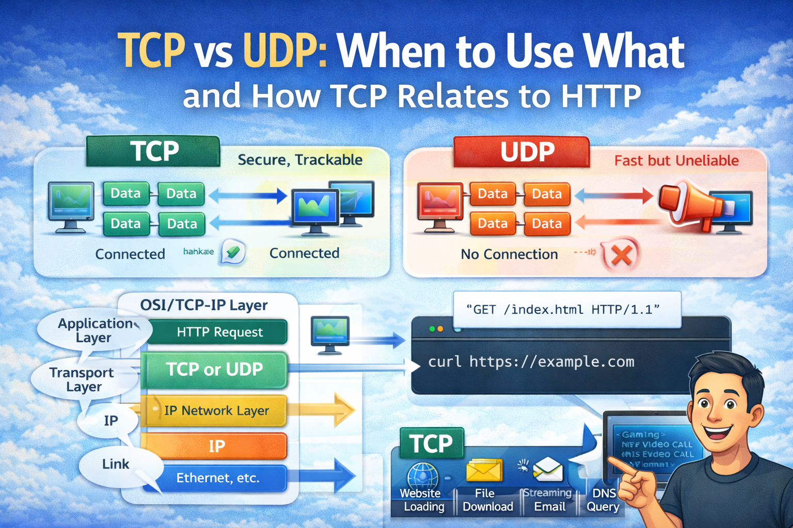

# TCP vs UDP: When to Use What, and How TCP Relates to HTTP



Let’s start with something simple.

The internet doesn’t just “send data”.

It follows **rules**.

Without rules, data packets would get lost, mixed up, duplicated, or arrive in the wrong order.

Two of the most important rule systems for sending data are:

- TCP
- UDP

And many beginners get confused about how HTTP fits into all this.

Let’s clear it step by step.

---

## What Are TCP and UDP (High-Level View)?

TCP and UDP are **transport protocols**.

That means their job is:

> To move data from one computer to another over the internet.

They sit between:

- Your application (browser, app, API)
- The network (IP layer)

Think of them as **delivery methods** for data.

---

## Simple Analogy: Safe Delivery vs Fast Delivery

Imagine sending something to your friend.

### TCP is Like a Courier Service 📦

- Confirms delivery
- Resends lost packages
- Keeps order
- Guarantees arrival

Reliable but slightly slower.

---

### UDP is Like a Public Announcement 📢

- Broadcasts information
- No confirmation
- No retry
- No guarantee

Fast but risky.

---

Now let’s understand their differences clearly.

---

## Key Differences Between TCP and UDP

| Feature          | TCP              | UDP            |
| ---------------- | ---------------- | -------------- |
| Connection setup | Yes              | No             |
| Reliability      | Guaranteed       | Not guaranteed |
| Order of data    | Maintained       | Not maintained |
| Speed            | Slightly slower  | Very fast      |
| Error checking   | Strong           | Basic          |
| Use case         | Accuracy matters | Speed matters  |

---

## When Should You Use TCP?

Use TCP when **data correctness is critical**.

If even one packet is missing, the result becomes useless.

---

### Common TCP Use Cases

- Website loading (HTTP/HTTPS)
- API requests
- File downloads
- Emails
- Database connections

Example:

When you download a PDF:

> You want the full file — not half.

So TCP is used.

---

## When Should You Use UDP?

Use UDP when **speed matters more than perfection**.

Small data loss is acceptable.

---

### Common UDP Use Cases

- Live video streaming
- Online gaming
- Voice calls (VoIP)
- Live broadcasts
- DNS queries

Example:

In a video call:

> It’s better to skip a frame than freeze the whole call.

So UDP is preferred.

---

## Real-World Examples (Easy Comparison)

### Watching YouTube Live

Uses UDP-based streaming.

Why?

Because real-time delivery matters more than perfect data.

---

### Loading a Website

Uses TCP.

Why?

Because missing HTML or CSS breaks the page.

---

### Online Multiplayer Games

Movement updates often use UDP.

Because:

- Speed matters
- Small packet loss is fine
- Continuous updates come anyway

---

### Downloading Software

Uses TCP.

Because:

- Every byte must be correct
- Corruption is unacceptable

---

## What Is HTTP and Where Does It Fit?

Now let’s talk about HTTP.

HTTP is NOT a transport protocol.

HTTP is an **application-level protocol**.

Its job is:

> To define how browsers and servers talk in a structured way.

HTTP decides:

- Request format
- Response format
- Status codes
- Headers
- Methods like GET and POST

But HTTP does NOT handle:

- Packet delivery
- Retransmission
- Network reliability

That’s TCP’s job.

---

## Relationship Between HTTP and TCP

Here’s the correct layering:

```
HTTP (Application Layer)
       ↓
TCP (Transport Layer)
       ↓
IP (Network Layer)
```

This means:

> HTTP runs on top of TCP.

HTTP uses TCP as its delivery system.

---

### Simple Explanation

HTTP writes the message:

> “Give me this webpage.”

TCP delivers that message safely to the server.

Server sends HTTP response back.

TCP delivers it safely to your browser.

---

## Why HTTP Does Not Replace TCP

Many beginners think:

> If HTTP sends data, why do we need TCP?

Because HTTP and TCP solve **different problems**.

---

### HTTP Solves

- What format should requests use
- How responses look
- How APIs communicate

---

### TCP Solves

- Packet ordering
- Packet loss recovery
- Connection reliability
- Data integrity

HTTP depends on TCP to work correctly.

Without TCP, HTTP would be unreliable.

---

## Common Beginner Confusion: Is HTTP the Same as TCP?

Short answer:

❌ No.

They live at different layers.

---

### Easy Memory Trick

- TCP = Delivery truck
- HTTP = Package format

You need both.

---

## Why This Matters for Developers

Understanding TCP vs UDP helps you:

- Design better systems
- Choose correct protocols
- Debug network issues
- Build scalable apps
- Understand cloud networking

Example:

- API performance tuning
- WebSocket behavior
- Streaming architecture
- Real-time application design

All depend on these basics.

---

## Final Thoughts

TCP and UDP are the **hidden highways of the internet**.

You don’t see them, but every app depends on them.

Remember:

- TCP = Safe, reliable, ordered
- UDP = Fast, lightweight, real-time
- HTTP = Communication rules on top of TCP

Once this mental model is clear, networking becomes much easier.
