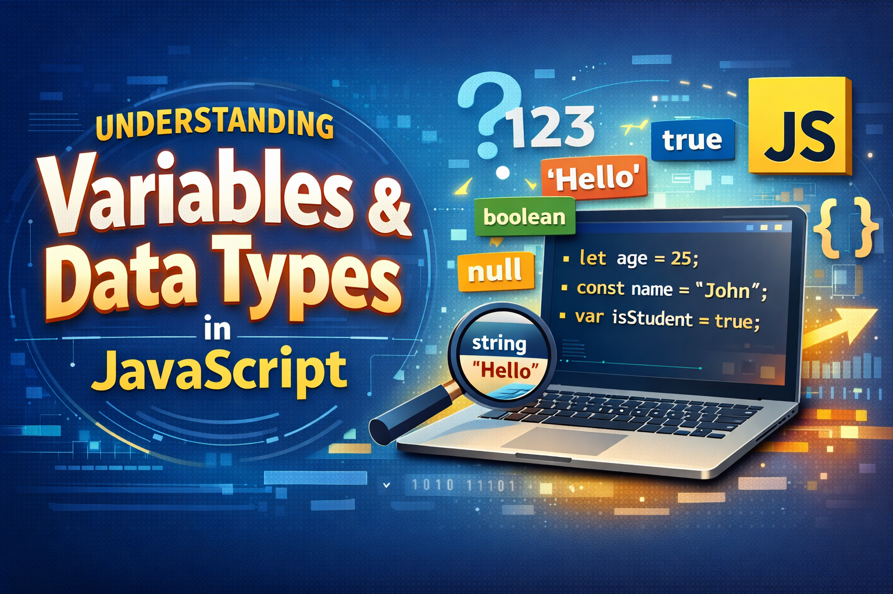
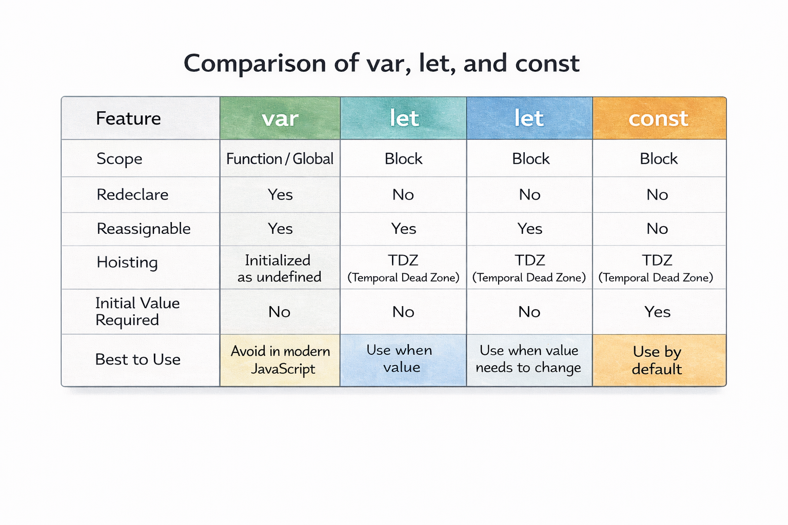

# Understanding Variables and Data Types in JavaScript


If you're starting your JavaScript journey, one of the first concepts you'll encounter is **Variables and Data Types**.

They are the foundation of everything in programming — from storing a user's name to handling complex application state.

In this guide, we'll break down:

- What variables are
- How `var`, `let`, and `const` work
- JavaScript primitive data types
- How JavaScript stores and copies values

All explained with **simple examples and real code outputs**.

So, let's start...

Imagine you are moving into a brand-new house. You have a truckload of items: furniture, clothes, kitchen gadgets, and some very fragile family heirlooms. To stay sane, you don’t just throw everything into the middle of the living room. You use **boxes**, and more importantly, you **label** them.

In the world of JavaScript, **Variables** are those labeled boxes, and **Data Types** are the specific items you put inside them. Understanding how to use these boxes correctly is the first step to becoming a master architect of the web.

## 1. The Labeled Boxes: What are Variables?

In programming, variables are containers used for storing data values. They allow us to give a name to a piece of information so we can refer to it, move it around, or change it later in our code.

### Example

```javascript
let userName = "Subhrangsu";
let age = 25;
let isDeveloper = true;

console.log(userName);
console.log(age);
console.log(isDeveloper);
```

Output

```
Subhrangsu
25
true
```

Here:

- `userName` → stores a **string**
- `age` → stores a **number**
- `isDeveloper` → stores a **boolean**

## The Rules of the Label (Naming Conventions)

Before you start labeling your boxes, JavaScript has a few rules you must follow.

### Case Sensitivity

```javascript
let myVariable = "Hello";
let myvariable = "World";

console.log(myVariable);
console.log(myvariable);
```

Output

```
Hello
World
```

These are **two different variables**.

### Characters Allowed

```javascript
let user_name = "Subhrangsu";
let $price = 100;
let _count = 10;

console.log(user_name, $price, _count);
```

Output

```
Subhrangsu 100 10
```

**Note:** Reserved keywords cannot be used as variable names.

### The Pro Tip: camelCase

```javascript
let isUserLoggedIn = true;
let totalPriceOfItems = 250;

console.log(isUserLoggedIn);
console.log(totalPriceOfItems);
```

Output

```
true
250
```

This naming style improves readability.

## 2. Meet the Three Label Makers: `var`, `let`, and `const`

Not all labels are created equal. Depending on which label you use, your variable behaves differently.

### The Old Reliable: `var`

The traditional method, `var`, is **function-scoped**.
If declared outside a function, it becomes **global**.

```javascript
var city = "Kolkata";

console.log(city);
```

Output

```
Kolkata
```

But `var` has a problem — it ignores block scope.

Example:

```javascript
if (true) {
	var hobby = "Coding";
}

console.log(hobby);
```

Output

```
Coding
```

Even though it was declared inside the block, it is still accessible outside.

### The Modern Standard: `let`

Introduced in 2015 (ES6), Introduced in ES6 (2015), `let` is used for variables whose values may change. It is block-scoped, meaning the variable only exists within the specific set of curly braces {} where you created it.

```javascript
let age = 30;

console.log(age);

age = 31;

console.log(age);
```

Output

```
30
31
```

Example with block scope:

```javascript
if (true) {
	let message = "Hello";
	console.log(message);
}

console.log(message);
```

Output

```
Hello
ReferenceError: message is not defined
```

If a variable is declared but not assigned a value, JavaScript automatically assigns `undefined`.

```js
let a;
console.log(a); // undefined

a = 45;
console.log(a); // 45
```

### The Permanent Vault: `const`

`const` is for constants. Once you assign a value to a `const` box, you cannot reassign it to something else. It is also block-scoped.

_*Important nuance:*_ While you cannot reassign the entire object or array stored in a `const` variable, you can still modify the values inside it.

```javascript
const myCity = "New York";

console.log(myCity);
```

Output

```
New York
```

Trying to change it:

```javascript
const myCity = "New York";

myCity = "London";
```

Output

```
TypeError: Assignment to constant variable
```

### Important Nuance with Objects

```javascript
const hero = {
	name: "Spider-Man",
	city: "New York",
};

hero.name = "Iron Man";

console.log(hero);
```

Output

```
{ name: 'Iron Man', city: 'New York' }
```

You **cannot replace the object**, but you **can modify its properties**.

## 3. What is Scope? (Your Variable's Neighborhood)

Scope is the context in which a variable is visible.

### Global Scope

```javascript
let greeting = "Hello World";

function showMessage() {
	console.log(greeting);
}

showMessage();
```

Output

```
Hello World
```

The variable is accessible everywhere.

### Local / Block Scope

```javascript
function testScope() {
	let secret = "Hidden Message";
	console.log(secret);
}

testScope();

console.log(secret);
```

Output

```
Hidden Message
ReferenceError: secret is not defined
```

The variable only exists **inside the function**.

## 4. Understanding Data Types: What’s in the Box?

JavaScript data types are generally divided into two categories:

1. Primitive
2. Non-Primitive

### Primitive Data Types

Primitive values are **immutable**, meaning their values cannot be changed once created.
This means operations on primitive values always produce a new value rather than modifying the original one.

### String

```javascript
let name = "Subhrangsu";

console.log(name);
console.log(typeof name);
```

Output

```
Subhrangsu
string
```

### Number

```javascript
let age = 25;
let price = 199.99;

console.log(age);
console.log(typeof age);
```

Output

```
25
number
```

### Boolean

```javascript
let isStudent = true;

console.log(isStudent);
console.log(typeof isStudent);
```

Output

```
true
boolean
```

### Null

```javascript
let weatherCondition = null;

console.log(weatherCondition);
console.log(typeof weatherCondition);
```

Output

```
null
object
```

Note: `typeof null` returns `"object"` due to a historical bug in JavaScript that has been kept for backward compatibility.

### Undefined

```javascript
let userInput;

console.log(userInput);
console.log(typeof userInput);
```

Output

```
undefined
undefined
```

### Symbol

```javascript
const uniqueId = Symbol("user");

console.log(uniqueId);
console.log(typeof uniqueId);
```

Output

```
Symbol(user)
symbol
```

### BigInt

```javascript
const bigNumber = 9007199254740991n;

console.log(bigNumber);
console.log(typeof bigNumber);
```

Output

```
9007199254740991n
bigint
```

## Checking the Type with `typeof`

```javascript
console.log(typeof "Hello");
console.log(typeof 42);
console.log(typeof true);
console.log(typeof null);
console.log(typeof undefined);
```

Output

```
string
number
boolean
object
undefined
```

## 5. Copying Values: The Beginner's Trap

Understanding how JavaScript copies values is very important because it affects how data behaves when assigned to another variable.

### Primitive → Copy by Value

```javascript
let hero = "Batman";
let copiedHero = hero;

copiedHero = "Superman";

console.log(hero);
console.log(copiedHero);
```

Output

```
Batman
Superman
```

They are **independent copies**.

### Objects → Copy by Reference

```javascript
let heroStats = { strength: 80 };

let copiedStats = heroStats;

copiedStats.strength = 100;

console.log(heroStats);
console.log(copiedStats);
```

Output

```
{ strength: 100 }
{ strength: 100 }
```

Both variables point to the **same object in memory**.

### Deep Copy Example

```javascript
let original = { power: 50 };

let clone = { ...original };
clone.power = 90;

console.log(original);
console.log(clone);
```

Output

```
{ power: 50 }
{ power: 90 }
```

Now they are **independent objects**.
For simple objects, the spread operator can be used. For deep nested objects, `structuredClone()` is safer.

## 6. Practical Lab: Observe the Behavior

```javascript
const studentName = "Subhrangsu";
let studentAge = 25;
let isGraduated = false;

console.log("Name:", studentName, "| Type:", typeof studentName);
console.log("Age:", studentAge, "| Type:", typeof studentAge);

// studentName = "Subha"
// TypeError: Assignment to constant variable.

studentAge = 26;

console.log("New Age:", studentAge);

let graduationYear = null;

console.log("Graduation Year:", graduationYear);
```

Output

```shell
Name: Subhrangsu | Type: string
Age: 25 | Type: number
New Age: 26
Graduation Year: null
```

## Summary Checklist



## Final Thoughts

Variables and data types are the building blocks of JavaScript.

Every program — from simple scripts to large applications —
relies on variables to store and manipulate data.

Key takeaways:

- Use `const` by default
- Use `let` when values need to change
- Avoid `var` in modern JavaScript
- Understand primitive vs reference types

Once you're comfortable with these concepts,
you can move on to operators, conditions, and functions in JavaScript.

## Deepen Your Learning

For the full code examples used in this blog:

1. **Exploring Variables**
   [variables.js](https://github.com/Subhrangsu90/JavaScript/blob/master/js-basics/02-variables.js)

2. **Mastering Data Types**
   [datatypes.js](https://github.com/Subhrangsu90/JavaScript/blob/master/js-basics/03-datatypes.js)
